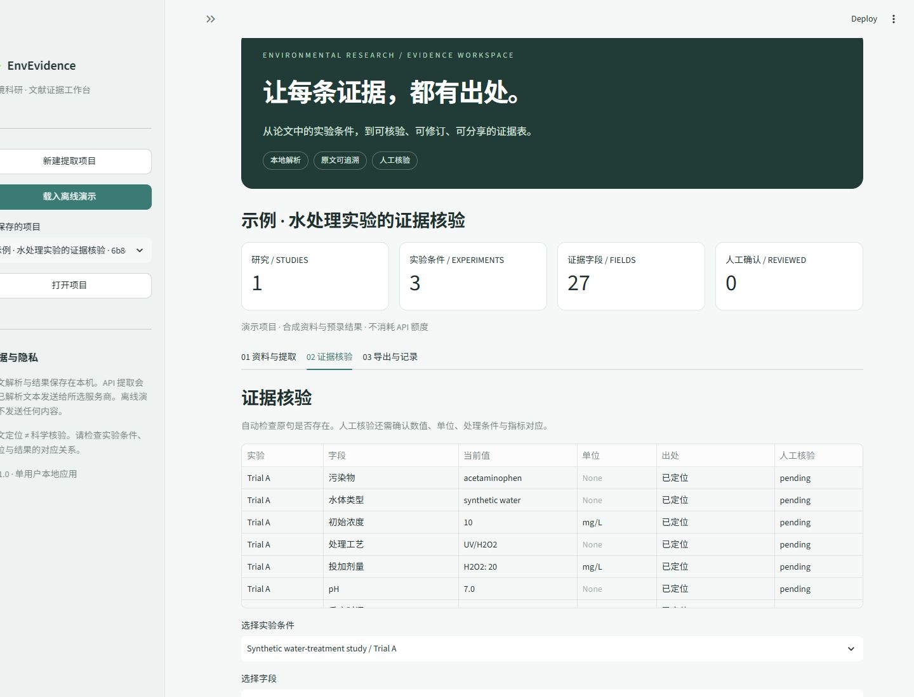

# EnvEvidence

**Extract environmental research evidence, with every field linked to its source.**

[中文](README.md) · [Demo](docs/DEMO.md) · [Architecture](docs/ARCHITECTURE.md) · [Validation status](docs/VALIDATION.md)

EnvEvidence is a local, single-user research application. Import text PDFs, explicitly attach supplements to each paper, extract experimental conditions using your own OpenAI or Anthropic API key, inspect the source passages, record human corrections, and export evidence tables.



## Quick start

Python 3.11+ is required. From the repository directory:

```bash
python -m venv .venv
# Windows:
.venv\Scripts\python.exe -m pip install -e .
.venv\Scripts\python.exe -m envevidence serve
# macOS / Linux:
.venv/bin/python -m pip install -e .
.venv/bin/python -m envevidence serve
```

Open <http://127.0.0.1:8501> and select **载入离线演示** (Load offline demo). No key or network is required for the synthetic demo. The current UI is Chinese; identifiers and exports are English.

You can also run the complete offline pipeline from the environment:

```bash
python -m envevidence demo --output data/demo
```

## Workflow and API setup

1. Create a project, select OpenAI or Anthropic, and enter a model ID available to your account with structured-output support.
2. Import main papers and associate each supplement with its paper. Select extraction fields or add custom ones.
3. Parse locally and inspect page coverage and warnings.
4. Provide a session-only key, or configure `OPENAI_API_KEY` / `ANTHROPIC_API_KEY`. Model defaults can be supplied through `OPENAI_MODEL` / `ANTHROPIC_MODEL`. `.env` files are not automatically loaded.
5. Explicitly accept sending the parsed text to the selected service. A provider error stops subsequent calls; completed papers remain saved and are skipped on resume.
6. Review each condition and field against the original source. Save corrections with reviewer, reason, and timestamp. Export CSV, Excel, or complete project JSON.

Water-treatment fields cover pollutant, matrix, initial concentration, treatment, reagent dose, pH, reaction time, pollutant removal, and mineralization/TOC removal as a separate endpoint. Each experiment has its own fields; raw model values remain unchanged after human revisions.

Custom field format: `key | label | extraction instruction | unit` (omit the last segment for unitless fields).

## Accuracy and privacy

**A located quotation is not a scientifically verified result.** It only means the quoted text exists on the specified page. All extracted values initially require human review. Check experimental association, value, unit, and endpoint interpretation.

- Text PDFs only, up to 30 MB and 250 pages per file; no OCR, plot digitization, or inferred unit conversion. Complex layouts and tables may parse incorrectly.
- Page numbers are physical PDF page indices, starting at 1, not printed journal page numbers.
- Missing means not found in the imported, successfully parsed material, not necessarily absent from the paper.
- Each study is sent in one request, with a 160,000-character preflight limit. No silent truncation. Provider context/output limits may be lower.
- Parsing and saving are local. Live extraction sends the parsed page text and field definitions to the selected API, not the original PDFs. Usage is billed to the user's provider account.
- OpenAI requests set `store=false`; this is not a zero-retention guarantee. Provider/account data policies still apply.
- Keys are not persisted. Project JSON contains source text, extraction results, token usage, model name, and reviewer history. `data/` is Git-ignored; configure another local location with `ENVEVIDENCE_DATA_DIR`.
- The app binds to loopback, disables Streamlit usage telemetry through the launch command, and is designed for one user. Avoid concurrent edits of the same project in multiple tabs.

Excel includes Evidence, Experiments, Revisions, Documents, and Runs sheets. The long-form CSV includes model/current values, citations, and review status; full JSON retains all parsed text and history.
Excel cells exceeding its length limit are explicitly marked as truncated; full values remain in JSON/CSV. Unsupported XML control characters are displayed as Unicode markers.

## Development

```bash
python -m pip install -e ".[dev]"
python -m pytest -q
python -m ruff check .
python -m build
```

Tests use invented, redistributable examples, not real scientific findings. API contracts are tested with mocked HTTP; see [validation status](docs/VALIDATION.md) for what has and has not been verified. Report problems through the issue template without credentials, private papers, or unpublished data.

Code and original synthetic fixtures are [MIT licensed](LICENSE). Dependencies retain their own licenses; see [third-party notices](THIRD_PARTY_NOTICES.md). OCR, cross-paper comparability analysis, and MCP integration are future work, not v0.1 features.
