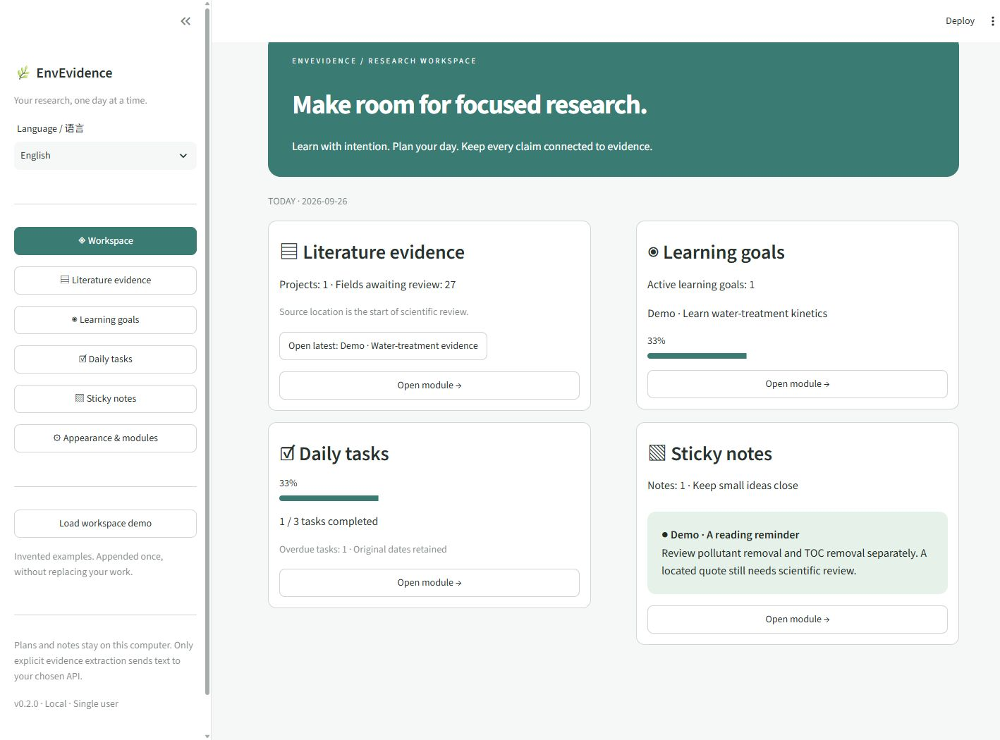
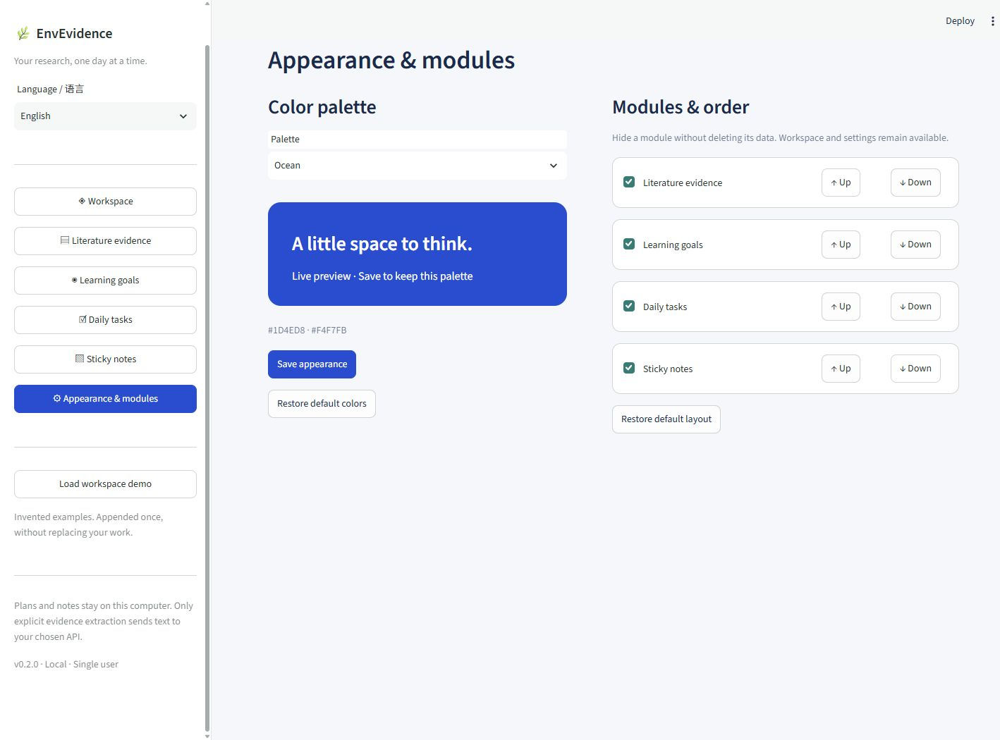
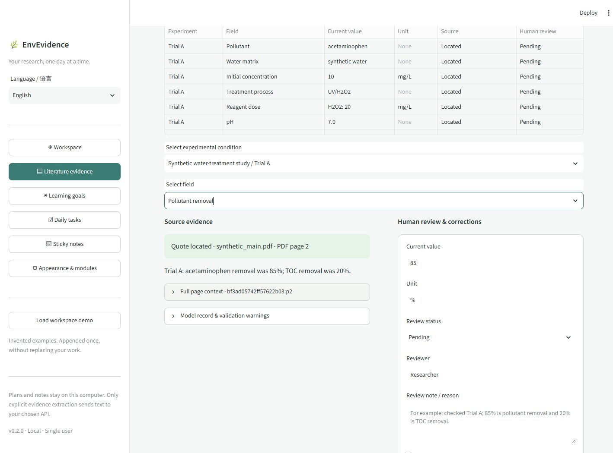

# EnvEvidence

**A local research workspace for learning, daily plans, notes, and source-linked evidence.**

[简体中文](README.zh-CN.md) · [Demo](docs/DEMO.md) · [Architecture](docs/ARCHITECTURE.md) · [Validation](docs/VALIDATION.md)

Plan your day and organize learning alongside a literature evidence workflow. EnvEvidence v0.2 opens in English, offers a complete Chinese interface, and keeps your planning data on your computer. You only need an OpenAI or Anthropic API key when extracting evidence from your own papers.



## Four configurable modules

| Module | What you can do |
|---|---|
| Literature evidence | Import text PDFs and supplements, extract conditions, review quotations, correct values, export CSV/Excel/JSON. |
| Learning goals | Create goals, descriptions and resource links; add, rename, remove and complete steps. Progress is completed steps divided by all steps. |
| Daily tasks | Plan by date and priority; use To do / In progress / Done; view today, another date or overdue work. |
| Sticky notes | Write, edit, pin, color, archive and restore notes. |

Goals and tasks can also be archived and restored. Archived items do not count toward current progress. No steps/tasks means an empty state, not a misleading completion percentage. Daily progress uses the selected planned date; overdue tasks keep their original dates. Dates follow the computer running the app.

Choose **Appearance & modules** to hide modules or move them up/down. Hiding never deletes their data; Workspace and settings remain accessible, even when every module is hidden. Desktop cards use two columns and narrow screens use one.

## Install and run

Requires Python 3.11+. Clone this repository and enter its directory:

```bash
git clone https://github.com/gzpagg/envevidence.git
cd envevidence
python -m venv .venv
```

Windows PowerShell:

```powershell
.\.venv\Scripts\python.exe -m pip install -e .
.\.venv\Scripts\python.exe -m envevidence serve
```

macOS / Linux:

```bash
.venv/bin/python -m pip install -e .
.venv/bin/python -m envevidence serve
```

Open <http://127.0.0.1:8501>. Select **Load workspace demo** to append invented examples once, without replacing your existing records. It makes no API calls. **Literature evidence → Load evidence demo** adds a separate synthetic evidence project whenever needed.

The sidebar **Language / 语言** selector switches English and Chinese. Your language, module order, visibility and saved colors survive restarts. User notes, paper text, model output and revision records are not translated or rewritten.

## Make it your workspace

| Palette | Accent | Background |
|---|---|---|
| Forest (default) | `#147D73` | `#F6F8F7` |
| Ocean | `#1D4ED8` | `#F4F7FB` |
| Sand | `#A84D18` | `#FAF7F2` |
| Graphite | `#6D4ACF` | `#F7F5FB` |

Choose **Custom** for your own accent and background. Text colors adapt; standard inputs and cards remain neutral for readability. Changes preview immediately; **Save appearance** makes them persistent. Restore colors and restore layout are separate actions.



## Storage and upgrading from v0.1

Evidence projects retain their existing version-1 JSON format. Workspace settings, goals, tasks and notes live separately at `data/workspace/state.json`. Both stores use atomic writes. `ENVEVIDENCE_DATA_DIR` changes the data root; back up the entire directory while the app is stopped. A damaged workspace file is reported and preserved, never silently reset. Avoid editing the same data from multiple browser tabs or app processes.

All planning features work locally without a model. The evidence module sends only the text you explicitly approve for extraction. Runtime data, virtual environments and credentials are excluded from Git and source packages. Export field keys and evidence audit history remain stable across language changes; historical/user-authored labels are preserved.



## Workflow and API setup

1. Create a project, select OpenAI or Anthropic, and enter a model ID available to your account with structured-output support.
2. Import main papers and associate each supplement with its paper. Select extraction fields or add custom ones.
3. Parse locally and inspect page coverage and warnings.
4. Provide a session-only key, or configure `OPENAI_API_KEY` / `ANTHROPIC_API_KEY`. Model defaults can be supplied through `OPENAI_MODEL` / `ANTHROPIC_MODEL`. `.env` files are not automatically loaded.
5. Explicitly accept sending the parsed text to the selected service. A provider error stops subsequent calls; completed papers remain saved and are skipped on resume.
6. Review each condition and field against the original source. Save corrections with reviewer, reason, and timestamp. Export CSV, Excel, or complete project JSON.

Water-treatment fields cover pollutant, matrix, initial concentration, treatment, reagent dose, pH, reaction time, pollutant removal, and mineralization/TOC removal as a separate endpoint. Each experiment has its own fields; raw model values remain unchanged after human revisions.

Custom field format: `key | label | extraction instruction | unit` (omit the last segment for unitless fields).

## Accuracy and privacy

**A located quotation is not a scientifically verified result.** It only means the quoted text exists on the specified page. All extracted values initially require human review. Check experimental association, value, unit, and endpoint interpretation.

- Text PDFs only, up to 30 MB and 250 pages per file; no OCR, plot digitization, or inferred unit conversion. Complex layouts and tables may parse incorrectly.
- Page numbers are physical PDF page indices, starting at 1, not printed journal page numbers.
- Missing means not found in the imported, successfully parsed material, not necessarily absent from the paper.
- Each study is sent in one request, with a 160,000-character preflight limit. No silent truncation. Provider context/output limits may be lower.
- Parsing and saving are local. Live extraction sends the parsed page text and field definitions to the selected API, not the original PDFs. Usage is billed to the user's provider account.
- OpenAI requests set `store=false`; this is not a zero-retention guarantee. Provider/account data policies still apply.
- Keys are not persisted. Project JSON contains source text, extraction results, token usage, model name, and reviewer history. `data/` is Git-ignored; configure another local location with `ENVEVIDENCE_DATA_DIR`.
- The app binds to loopback, disables Streamlit usage telemetry through the launch command, and is designed for one user. Avoid concurrent edits of the same project in multiple tabs.

Excel includes Evidence, Experiments, Revisions, Documents, and Runs sheets. The long-form CSV includes model/current values, citations, and review status; full JSON retains all parsed text and history.
Excel cells exceeding its length limit are explicitly marked as truncated; full values remain in JSON/CSV. Unsupported XML control characters are displayed as Unicode markers.

## Development

```bash
python -m pip install -e ".[dev]"
python -m pytest -q
python -m ruff check .
python -m build
```

Tests use invented, redistributable examples, not real scientific findings. API contracts are tested with mocked HTTP; see [validation status](docs/VALIDATION.md) for what has and has not been verified. Report problems through the issue template without credentials, private papers, or unpublished data.

Code and original synthetic fixtures are [MIT licensed](LICENSE). Dependencies retain their own licenses; see [third-party notices](THIRD_PARTY_NOTICES.md). OCR, cross-paper comparability analysis, and MCP integration are future work, not v0.2 features.
