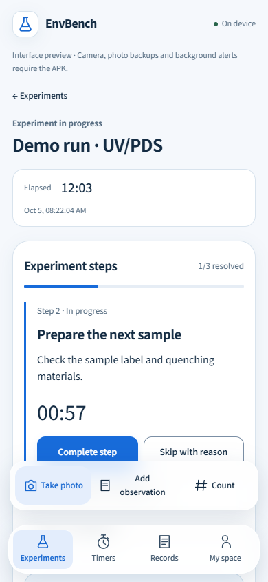
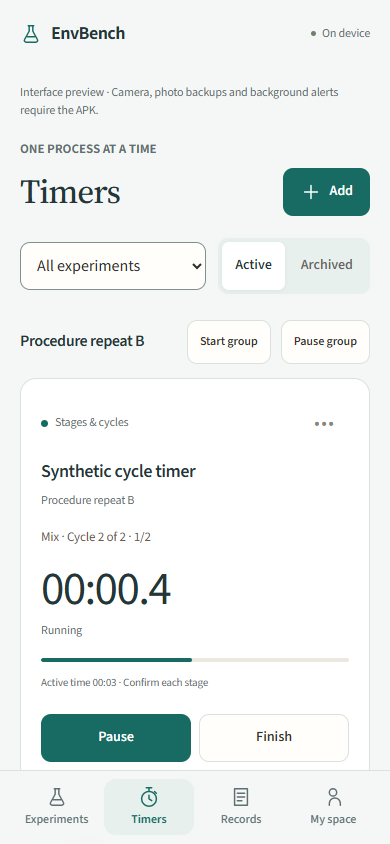
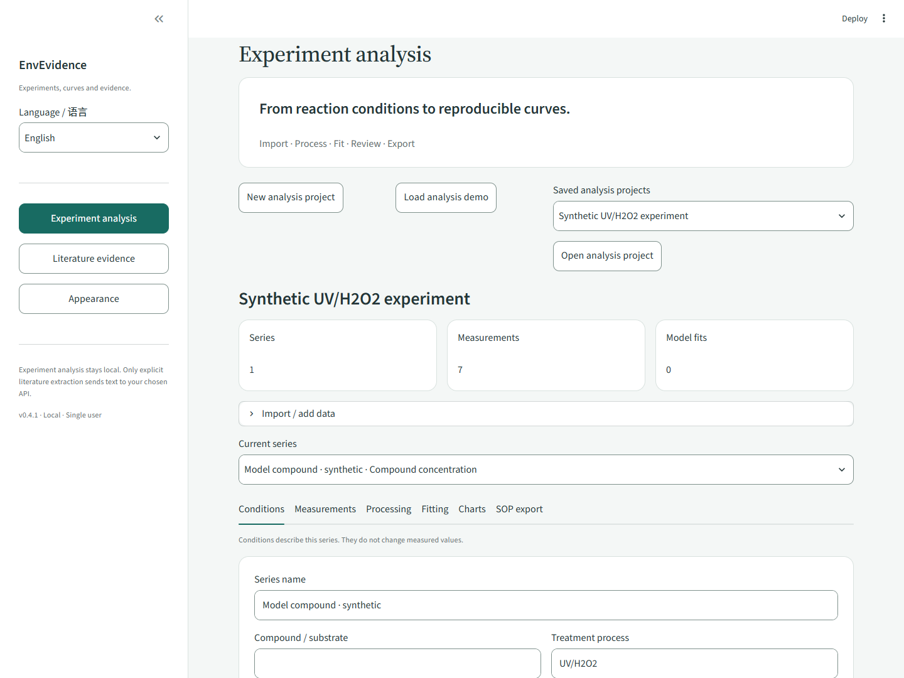
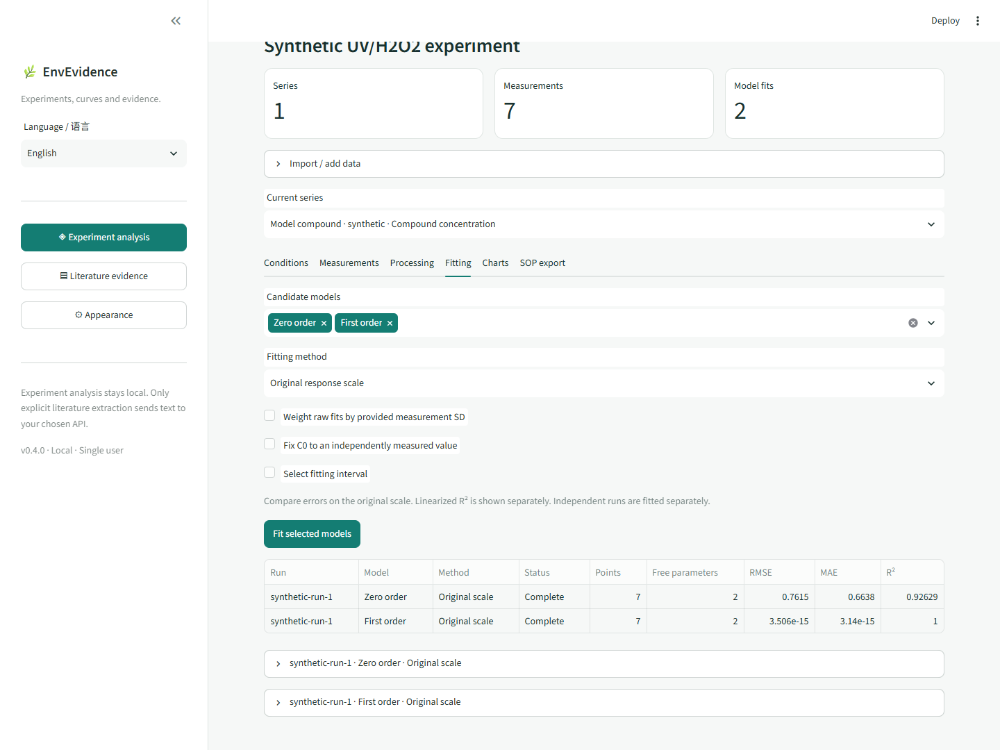
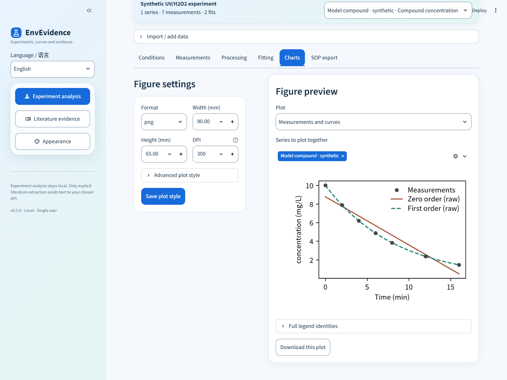
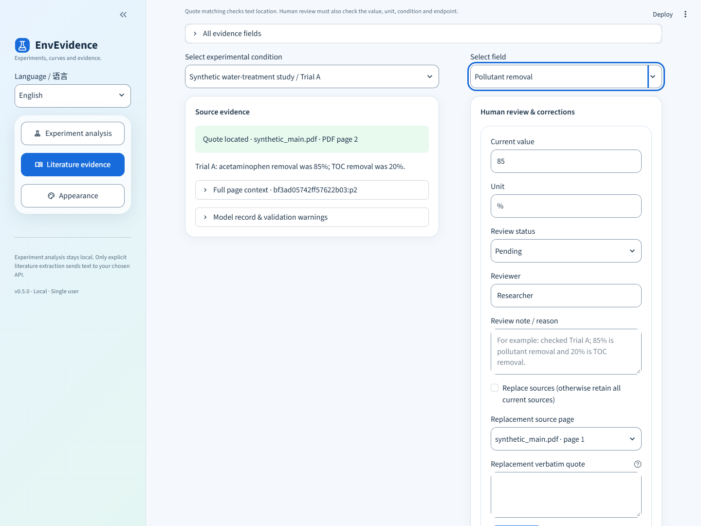

# EnvBench & EnvEvidence

**Record experiments at the bench. Process measurements, fit kinetics and trace literature evidence at your desk.**

[简体中文](README.zh-CN.md) · [Android app](android/README.md) · [Analysis guide](docs/ANALYSIS.md) · [Validation](docs/VALIDATION.md)

| App | Where it fits | What you get |
|---|---|---|
| **EnvBench 0.7.0 · Android** | Sampling, quenching and observations during water and wastewater experiments | Experiment steps, reusable templates, stage timers, voice observations, samples and CSV exports |
| **EnvEvidence 0.4.1 · Desktop** | Processing experiments and reviewing water-treatment papers | Kinetic fits, publication-size figures, reproducible SOP packages and source-linked evidence tables |

Both apps have English and Chinese interfaces, saved appearance settings and local data storage. Shared mineral-teal accents, light neutral surfaces, locally bundled Source Sans 3 and Source Serif 4 fonts, and consistent controls connect the bench and desktop workspaces.

## EnvBench: your reaction run, in one place

Keep the sampling plan, sampling events and analytical results together. EnvBench is designed around advanced oxidation and DOM research, with process presets including UV/PDS, UV/H₂O₂, ozone and Fenton.

- **Stay on the sampling schedule.** A prominent countdown shows the next checkpoint; planned and recorded times remain separate.
- **Record each sample.** Capture the quench agent, pH, temperature, volume and a short note, then attach a photo. Field labels distinguish measured values from values carried over from another sample.
- **Keep the water matrix with the run.** Store DOC, UV₂₅₄, alkalinity, major ions and other matrix properties; SUVA₂₅₄ is calculated from DOC and UV₂₅₄.
- **Review concentration trends.** Paste labelled LC peak areas or enter C/C₀, inspect the import preview and see a pseudo-first-order fit with k_obs, its 95% confidence interval, t½ and R².
- **Export your experiment.** Share tidy sample CSVs, an individual experiment ZIP or a full backup with original photos.

Four tools help you prepare, carry out and repeat a procedure:

| Tool | How it helps |
|---|---|
| **Experiment steps** | Keep named instructions beside the reaction. Start, complete or repeat a step, or skip it with a reason; each action stays in its history. A timed step starts its own countdown. |
| **Stage timers** | Build named stages, repeat the sequence and set a start delay. Choose automatic transitions or confirmation between stages; see the current stage, round and time remaining. |
| **Voice observations** | Record and replay an audio note, use system speech input to draft editable text, or insert your own observation phrases. Notes follow the current step and can include photos. |
| **Experiment templates** | Save conditions, water-matrix properties, sampling times, steps and independent timer presets. Start a fresh experiment with its own template snapshot, samples and results. |

Stopwatches, countdowns, stage timers, sampling reminders and counters can run in parallel. There is no fixed cap on the number of timers. Settings, language, appearance and backup controls are grouped under **My space**.

 

 

**Android 8.0+ · Offline · No account required**

**[Download EnvBench 0.7.0 APK](https://github.com/gzpagg/envevidence/releases/download/v0.7.0-android-preview.1/envbench-0.7.0-android.apk)** · [SHA-256](https://github.com/gzpagg/envevidence/releases/download/v0.7.0-android-preview.1/envbench-0.7.0-android.apk.sha256) · [Release notes](https://github.com/gzpagg/envevidence/releases/tag/v0.7.0-android-preview.1) · [Installation guide](android/README.md). Open **My space → Load lab demo** to explore an invented UV/PDS run with samples and water-matrix data.

## EnvEvidence: from reaction conditions to reproducible curves

Keep the conditions, measurements and analysis decisions together. Import quantified concentration, TOC, COD, adsorption or biological-rate data; choose your processing rules and kinetic models; then export the data, figures and complete procedure as one package.

| Step | Workflow |
|---|---|
| **Conditions** | Record the treatment, water matrix, dose, pH, temperature, reactor volume and rate source for each series. |
| **Measurements** | Paste a table, map CSV/Excel columns, or import an EnvBench CSV/ZIP and link assay results by sample ID. |
| **Processing** | Apply explicit blank/dilution corrections, unit conversion, normalization or adsorption mass balance. Keep every original and exclusion reason. |
| **Fitting** | Compare zero-, first-, second-order and plateau decay; adsorption PFO/PSO and diffusion; or Monod substrate–rate curves. Each independent run is fitted separately. |
| **Charts** | Inspect original-scale errors and residuals. Set figure dimensions, labels, style, PNG/TIFF/SVG and DPI. |
| **SOP export** | Confirm the fits, save a reusable template, and export originals, tables, figures, hashes and a replayable configuration. |

Original-scale fitting is the default. Applicable linearizations have separate transformed-scale metrics. Parameters carry units and uncertainty diagnostics; the comparison table keeps model selection in the researcher's hands.



 

Open **Experiment analysis → Load analysis demo** to use a self-created UV/H₂O₂ concentration series. Follow the [analysis guide](docs/ANALYSIS.md) to connect phone samples, compare models and replay an exported SOP. Analysis runs locally without an API key.

## Literature values with their sources

Import a paper and its supplements, extract the experimental conditions, and review every field beside the quoted source. EnvEvidence keeps the model's original value and the reviewer's correction together, so you can revisit the decision later.

| Step | Workflow |
|---|---|
| **Import** | Add text PDFs and associate supplements with their main papers. Inspect parsed page coverage. |
| **Extract** | Select the water-treatment template or define your own fields. OpenAI and Anthropic adapters use the same record structure. |
| **Review** | Check values, units and experiment associations against the source quotation and page context. Save the reviewer, reason and time. |
| **Export** | Download long-form CSV, Excel or the complete project JSON with source text and revision history. |

Pollutant removal and mineralization/TOC removal have separate fields. Different experimental conditions produce separate records, and each key field carries a source location or a clear missing-value status.



### Install the desktop app

**[Download 0.4.1 source ZIP](https://github.com/gzpagg/envevidence/releases/download/v0.4.1/envevidence-0.4.1-source.zip)** · [Python wheel](https://github.com/gzpagg/envevidence/releases/download/v0.4.1/envevidence-0.4.1-py3-none-any.whl) · [Release notes and checksums](https://github.com/gzpagg/envevidence/releases/tag/v0.4.1)

Requires **Python 3.11+**. Extract the source ZIP and open its project folder, or clone the repository below. Create a virtual environment with `python -m venv .venv` before running the install commands:

```bash
git clone https://github.com/gzpagg/envevidence.git
cd envevidence
python -m venv .venv
```

Windows PowerShell:

```powershell
.\.venv\Scripts\python.exe -m pip install -e .
.\.venv\Scripts\python.exe -m envevidence serve
```

macOS / Linux:

```bash
.venv/bin/python -m pip install -e .
.venv/bin/python -m envevidence serve
```

For the wheel, use `-m pip install "path/to/envevidence-0.4.1-py3-none-any.whl"` in place of `-m pip install -e .` with the same virtual-environment Python.

Open <http://127.0.0.1:8501>. The app starts on **Experiment analysis**; choose **Load analysis demo** to explore synthetic measurements, or **Literature evidence → Load evidence demo** for a synthetic paper and supplement. Both demos run without an API key. The desktop version is **0.4.1**.

### Extract from your own papers

1. Create a project, choose OpenAI or Anthropic and enter a model ID supported by your account.
2. Import the main paper and supplements, then select extraction fields.
3. Parse the files locally and check page coverage.
4. Enter a session-only API key, or set `OPENAI_API_KEY` / `ANTHROPIC_API_KEY` in the environment. Confirm the text to send and start extraction.
5. Review the extracted fields and save corrections before exporting.

`OPENAI_MODEL` and `ANTHROPIC_MODEL` provide default model IDs. `.env` files are not loaded automatically. Custom fields use `key | label | extraction instruction | unit`; the unit segment is optional.

Text PDFs are supported up to 30 MB and 250 pages per file. The [demo guide](docs/DEMO.md) explains the review workflow; the [validation record](docs/VALIDATION.md) describes parsing and model-evaluation coverage.

## Language, appearance and your data

Switching language changes interface labels while preserving paper text, sample names, model results and revision records. New installations use the same Mineral · teal palette on both platforms. Source Serif 4 marks the main title; Source Sans 3 and a bundled Chinese sans-serif subset handle controls and body text. Desktop appearance offers Mineral · teal, Clay, Forest, Ocean, Sand, Graphite and custom colors. Saved palettes and custom colors continue across updates.

EnvBench stores records, original photos and audio clips in private Android storage; templates, step histories and observation phrases travel with ZIP backups. Use a full ZIP backup before uninstalling or moving devices. EnvEvidence stores evidence projects and preferences under `data/`, with independent experiment projects under `data/analysis/`; `ENVEVIDENCE_DATA_DIR` selects another local directory. Back up that directory while the desktop app is stopped. Data from earlier versions is retained during compatible upgrades.

Phone CSV/ZIP exports provide a one-way transfer into desktop analysis. Uploaded files keep their bytes and SHA-256 hashes; manual entries have input snapshots and revision history. Each SOP export receives a unique filename. To replay an extracted package from the repository directory, use `.\.venv\Scripts\python.exe -m envevidence analyze --config "path/to/extracted/analysis_config.json" --output data/replayed` on Windows, or replace the Python path with `.venv/bin/python` on macOS/Linux. See the [analysis guide](docs/ANALYSIS.md) for the package contents and replay checks.

The experiment workflow runs locally. Desktop extraction sends the parsed text and field definitions to the API service you choose; the API key stays out of project files. Runtime data and credentials are excluded from this repository.

## Development and documentation

```bash
python -m pip install -e ".[dev]"
python -m pytest -q
python -m ruff check .
python -m build
node --test android/tests/*.test.cjs
```

[Analysis workflow and models](docs/ANALYSIS.md) · [Evidence demo](docs/DEMO.md) · [Android screenshots and checks](docs/ANDROID.md) · [Samples CSV](docs/BENCH_CSV.md) · [Architecture](docs/ARCHITECTURE.md) · [Validation](docs/VALIDATION.md) · [Changelog](CHANGELOG.md)

Report reproducible problems through the issue templates. Code and original synthetic examples are [MIT licensed](LICENSE); dependency licenses are listed in [third-party notices](THIRD_PARTY_NOTICES.md).
