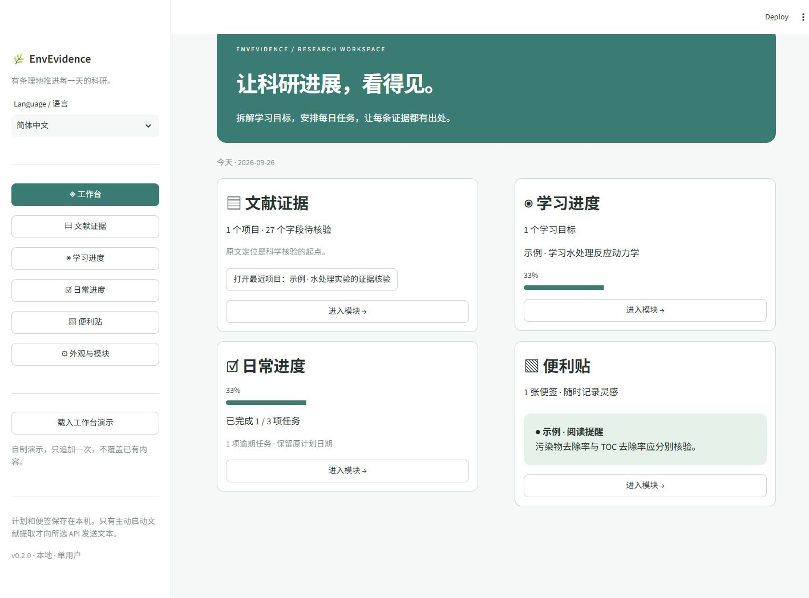
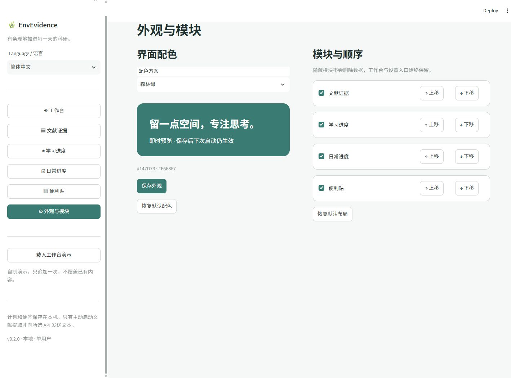
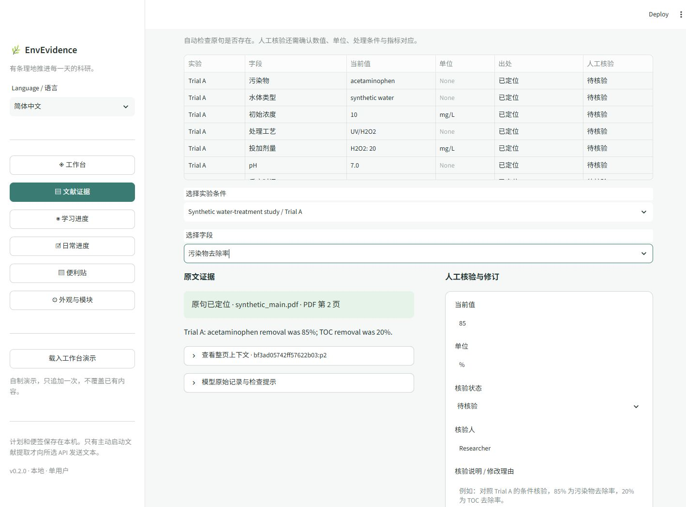

# EnvEvidence

**在本机管理学习、日常任务和便签，并将文献结果整理为可核验的证据表。**

[English](README.md) · [演示](docs/DEMO.zh-CN.md) · [技术说明](docs/ARCHITECTURE.zh-CN.md) · [验证状态](docs/VALIDATION.zh-CN.md)

v0.2 将文献证据工具扩展为个人科研工作台。默认英文，可在侧栏切换简体中文；新增计划管理完全在本地运行，只有提取自己的论文时才需要 OpenAI 或 Anthropic API 密钥。



## 四个可配置模块

| 模块 | 已实现能力 |
|---|---|
| 文献证据 | 导入文本型 PDF 与补充材料，提取实验条件，核对原文，人工修订并导出。 |
| 学习进度 | 目标、说明、资源链接及步骤清单；步骤可以新增、改名、移除和勾选完成。 |
| 日常进度 | 按日期与优先级安排任务，切换待办／进行中／已完成，查看今天、指定日期和逾期任务。 |
| 便利贴 | 创建、编辑、置顶、选色、归档和恢复。 |

学习进度＝已完成步骤数／全部步骤数；没有步骤时显示“尚未添加步骤”。当日进度＝该计划日期已完成任务数／全部有效任务数。逾期任务单列，日期不会自动改变；日期取运行应用电脑的本地日期。目标、任务和便签都可归档和恢复，归档内容不计入当前进度。

在“外观与模块”中启用、隐藏、上移或下移模块；隐藏不删除数据，工作台和设置入口始终保留。桌面首页为双列，窄屏改为单列。

## 安装与启动

需要 Python 3.11 或更新版本。下载或克隆仓库，进入项目目录：

```bash
git clone https://github.com/gzpagg/envevidence.git
cd envevidence
python -m venv .venv
```

Windows PowerShell：

```powershell
.\.venv\Scripts\python.exe -m pip install -e .
.\.venv\Scripts\python.exe -m envevidence serve
```

macOS / Linux：

```bash
.venv/bin/python -m pip install -e .
.venv/bin/python -m envevidence serve
```

浏览器打开 <http://127.0.0.1:8501>，在“Language / 语言”选择“简体中文”。点击“载入工作台演示”，将一次性追加自制示例，不覆盖已有记录、不调用模型。文献证据中的“载入离线演示”可另外创建合成证据项目。

## 配色与保存

预设森林绿、海洋蓝、暖灰橙、石墨紫，也可自定义主色和背景。文字自动搭配，标准输入框和卡片保持中性色，错误与警告保留语义颜色。即时预览后点击“保存外观”；恢复默认配色和恢复默认布局分别操作。



语言、已保存配色、模块排序与可见性在重启后恢复。文献项目仍采用原来的版本 1 JSON 格式；学习、任务、便签和偏好保存在独立的 `data/workspace/state.json`。可用 `ENVEVIDENCE_DATA_DIR` 更改数据根目录，关闭应用后备份整个目录。损坏文件会报错并保留，不会悄悄清空。请避免多个标签页或进程同时编辑同一数据。

语言切换不改写用户输入、论文原文、模型结果和修订记录；导出的机器字段键保持稳定，历史字段标签保留原始内容。



## 使用自己的论文

1. 点击“新建提取项目”，填写名称、服务商和模型 ID；模型必须在你的账户中可用并支持结构化输出。
2. 选择主文献和补充材料，逐个指定补充材料所属主文献；选择或添加字段。
3. 点击“解析并建立项目”。检查成功解析的页数、解析警告和本地文本。
4. 在“资料与提取”中输入 API 密钥，确认文本发送范围后开始提取。
5. 在“证据核验”中选择实验和字段，查看引用原句与整页上下文；填写核验人和说明，保存记录。
6. 在“导出与记录”下载结果。关闭应用后重新启动，仍可打开已保存项目。

密钥也可通过环境变量提供。`.env.example` 仅作说明，应用**不会自动读取 `.env` 文件**。不要把真实密钥写入仓库。

```powershell
$env:OPENAI_API_KEY = "你的密钥"
$env:OPENAI_MODEL = "你账户中可用的模型ID"
# 或：
$env:ANTHROPIC_API_KEY = "你的密钥"
$env:ANTHROPIC_MODEL = "你账户中可用的模型ID"
```

自定义字段每行使用 `英文键名 | 显示名称 | 提取说明 | unit`；第四项仅在需要单位时填写。

```text
temperature | 温度 | 本实验的反应温度 | unit
catalyst | 催化剂 | 催化剂名称和组成
```

命令行真实提取（需显式允许发送文本）：

```bash
python -m envevidence extract main.pdf --supplement supplement.pdf --provider openai --model YOUR_MODEL_ID --send-text --output data/my-study
```

如有跳过的页面，CLI 默认停止。检查后可加 `--allow-partial`。批量工作、恢复中断和人工核验使用界面。

## 科研边界和数据去向

**“原句已定位”只表示文字在指定页存在，不证明模型理解、实验归属或结论正确。**模型提取后所有字段均为待人工核验，不提供未经校准的置信概率。不要把已定位当作已验证。

- 第一版只解析文本型 PDF；不做 OCR、图像读数或自动单位换算。双栏、公式和复杂表格可能产生错误，需检查整页上下文和原 PDF。
- “未找到”仅针对已经导入并成功解析的资料，不能推出原论文未报告。
- 页码指 PDF 文件页序（从 1 开始），可能不同于期刊印刷页码。
- 每组主文献及补充材料上限为 160,000 字符；超限在发送前拒绝，不静默截断。模型上下文或输出上限仍可能更低。
- 单用户本地应用，不支持多用户协同；同一项目请勿在多个标签页同时修改。
- PDF 解析、字段核验、结果保存和导出均在本机完成。API 提取发送全部成功解析页面的文本及字段说明；不上传原 PDF。API 使用按服务商规则计费。
- OpenAI 请求使用 `store=false`；这不等于服务商承诺零保留。数据处理仍取决于用户账户与服务条款。
- 密钥仅保留在进程环境或当前界面会话，不写入项目。项目 JSON 包含解析原文、模型结果、模型名称、用量、核验人与修订记录。
- Excel 遇到超出单元格长度上限的内容会显式标记截断，完整内容保留在 JSON/CSV 中；不支持的控制字符以 Unicode 标记展示。
- 默认数据目录为启动位置下的 `data/`，可用 `ENVEVIDENCE_DATA_DIR` 改变。该目录被 Git 忽略，备份和分享前请检查内容。
- 没有遥测或自动上传功能，启动命令关闭 Streamlit 使用统计。应用监听 `127.0.0.1`。

## 开发与验证

```bash
python -m pip install -e ".[dev]"
python -m pytest -q
python -m ruff check .
python -m build
```

合成案例生成脚本为 `scripts/build_demo.py`。测试覆盖实验分离、指标区别、补充材料、原文定位、缺少单位、人工修订、API 中断恢复、拒绝/截断响应以及表格公式注入防护。两家 API 使用模拟 HTTP 响应验证，真实 API 验证状态见 [VALIDATION](docs/VALIDATION.zh-CN.md)。

## 开源与后续方向

代码与自制合成示例采用 [MIT 许可](LICENSE)；第三方组件保留各自许可，详见 [THIRD_PARTY_NOTICES](THIRD_PARTY_NOTICES.md)。仓库不包含真实科研论文、个人实验数据或 API 密钥。

欢迎通过 Issue 提交可复现的错误案例，尤其是实验条件串行、错误单位、指标混淆或引用归属错误。请仅附可以公开分发的材料。

后续方向为本地 OCR/复杂表格解析、实验可比性检查、MCP 接口。它们尚未在 v0.2.0 实现。GitHub 发布说明见 [发布指南](docs/PUBLISHING.zh-CN.md)。
