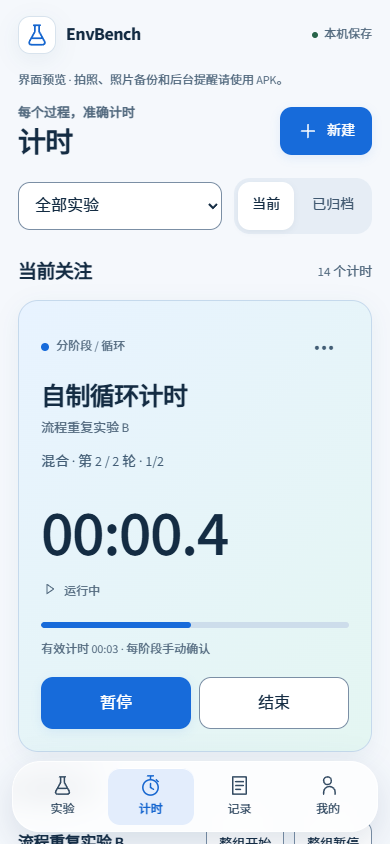
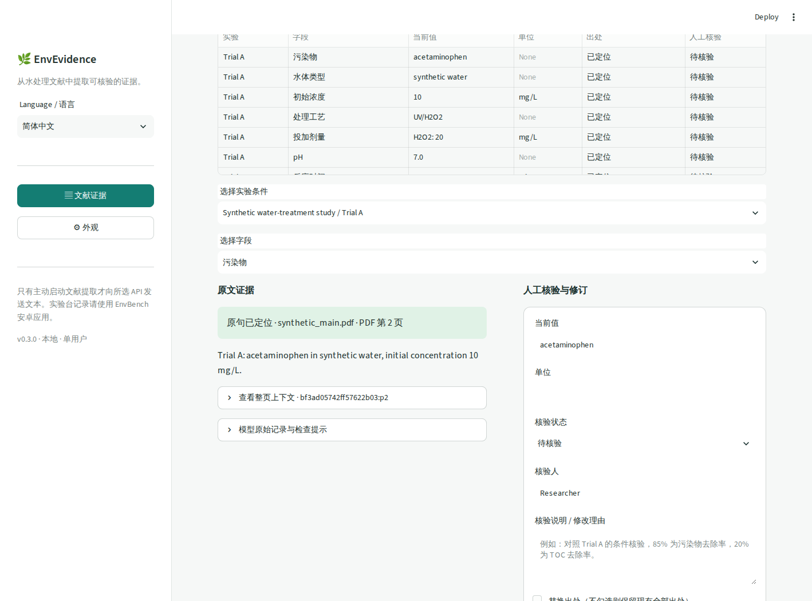

# EnvBench 与 EnvEvidence

**在实验台记录反应过程，在电脑上处理测量数据、拟合动力学并核验文献证据。**

[English](README.md) · [安卓应用](android/README.zh-CN.md) · [实验分析指南](docs/ANALYSIS.zh-CN.md) · [验证记录](docs/VALIDATION.zh-CN.md)

| 应用 | 使用场景 | 能够获得什么 |
|---|---|---|
| **EnvBench 0.7.0 · 安卓** | 水与污水实验中的取样、淬灭和现象记录 | 实验步骤、复用模板、分阶段计时、语音现象、样品记录与 CSV 导出 |
| **EnvEvidence 0.4.1 · 电脑** | 处理实验数据、阅读和整理水处理文献 | 动力学拟合、指定尺寸的科研图、可重跑的 SOP 成果包和文献证据表 |

两个应用均提供中英文界面、可保存的外观设置和本地数据存储。两端使用同一套矿物青与浅色中性背景、本地 Source Sans 3 和 Source Serif 4 字体及一致的控件，让实验台与电脑工作区保持连贯。

## EnvBench：把一次反应实验记录完整

将取样计划、现场操作与分析结果放在同一次实验中。EnvBench 围绕高级氧化与 DOM 研究设计，提供 UV/PDS、UV/H₂O₂、臭氧、芬顿等工艺选项。

- **掌握取样节奏。** 醒目的倒计时展示下一取样点，计划时间与实际记录时间分别保存。
- **记录每个样品。** 保存淬灭剂、pH、温度、体积和简短说明，并为样品添加照片。字段标签区分实测值与沿用值。
- **保留水体背景。** 记录 DOC、UV₂₅₄、碱度、主要离子及其他基质信息，由 DOC 和 UV₂₅₄ 计算 SUVA₂₅₄。
- **查看浓度变化。** 粘贴带样品编号的 LC 峰面积或填写 C/C₀，核对导入预览，查看准一级拟合及 k_obs、95% 置信区间、t½ 和 R²。
- **导出实验资料。** 导出整洁的样品 CSV、单次实验 ZIP，或包含原始照片的完整备份。

四项工具贯穿实验准备、执行与复用：

| 工具 | 使用方式 |
|---|---|
| **实验步骤** | 将命名步骤和操作说明放在反应旁，开始、完成、重新执行，或说明理由后跳过；各次操作保留历史。带时长的步骤会启动独立倒计时。 |
| **分阶段计时** | 设置多个命名阶段、整组重复次数和开始延迟，选择自动切换或逐步确认，查看当前阶段、轮次与剩余时间。 |
| **语音现象** | 录制并回放实验口述，使用系统语音输入形成可编辑文字，或插入自己的常用现象短语；记录可关联当前步骤并配照片。 |
| **实验模板** | 保存反应条件、水体信息、取样计划、步骤和独立计时预设；开始新实验时保存独立模板快照，逐次积累样品与结果。 |

秒表、倒计时、分阶段计时、取样提醒与计数器可以并行使用；计时器数量没有固定上限。设置、语言、外观和备份入口集中在 **我的**。

 

 

**Android 8.0+ · 离线运行 · 无需账号**

**[下载 EnvBench 0.7.0 APK](https://github.com/gzpagg/envevidence/releases/download/v0.7.0-android-preview.1/envbench-0.7.0-android.apk)** · [SHA-256 校验](https://github.com/gzpagg/envevidence/releases/download/v0.7.0-android-preview.1/envbench-0.7.0-android.apk.sha256) · [发布说明](https://github.com/gzpagg/envevidence/releases/tag/v0.7.0-android-preview.1) · [安装指南](android/README.zh-CN.md)。在 **我的 → 载入实验演示** 中，可体验一组自制 UV/PDS 反应、样品与水质记录。

## EnvEvidence：从反应条件，到可复现的动力学曲线

将反应条件、测量数据和处理决定放在同一个项目中。输入已经定量的模型化合物浓度、TOC、COD、吸附量或生物反应速率，选择处理规则与动力学模型，再将原始资料、数据表、图像和完整处理流程一起导出。

| 步骤 | 使用流程 |
|---|---|
| **反应条件** | 为各系列保存处理工艺、水体基质、剂量、pH、温度、反应体积和速率来源。 |
| **测量数据** | 粘贴表格、映射 CSV／Excel 字段，或导入手机 CSV／ZIP，通过样品编号关联检测结果。 |
| **数据处理** | 明确设置空白／稀释校正、单位换算、归一化或吸附质量平衡，保留原始资料与排除理由。 |
| **动力学拟合** | 比较零级、一级、积分二级及带平台衰减，吸附拟一级／拟二级与扩散，或 Monod 底物—速率曲线；独立实验分别拟合。 |
| **图表格式** | 检查原始尺度误差与残差，设置图像尺寸、标题、样式、PNG／TIFF／SVG 和 DPI。 |
| **SOP 导出** | 确认采用的拟合结果、保存复用模板，导出原文件、表格、图片、校验值和可重跑配置。 |

默认在原始响应尺度拟合；适用的线性化另列变换尺度指标。参数带单位与不确定性诊断，比较表为研究者提供选择依据。


 

打开 **实验分析 → 载入分析演示**，即可使用一组自制 UV/H₂O₂ 浓度数据。[实验分析指南](docs/ANALYSIS.zh-CN.md)介绍手机样品关联、模型比较及 SOP 重跑。实验分析在本地完成，无需 API 密钥。

## 让文献数值带着出处

导入论文与补充材料，提取实验条件，并在引用原文旁逐项核验。EnvEvidence 将模型原始值与人工修订一同保存，方便之后回查判断依据。

| 步骤 | 使用流程 |
|---|---|
| **导入** | 添加文本型 PDF，将补充材料关联到主文献，检查解析页面覆盖情况。 |
| **提取** | 使用水处理模板或自定义字段；OpenAI 和 Anthropic 适配器共用同一记录结构。 |
| **核验** | 对照引用原句与页面上下文，检查数值、单位和实验归属，保存核验人、理由与时间。 |
| **导出** | 下载长表 CSV、Excel 或包含原文和修订历史的完整项目 JSON。 |

污染物去除率与矿化／TOC 去除率分别记录。不同实验条件独立成行；每个关键字段均有出处位置或明确的缺失状态。



### 安装电脑版

**[下载 0.4.1 源码 ZIP](https://github.com/gzpagg/envevidence/releases/download/v0.4.1/envevidence-0.4.1-source.zip)** · [Python wheel](https://github.com/gzpagg/envevidence/releases/download/v0.4.1/envevidence-0.4.1-py3-none-any.whl) · [发布说明与校验文件](https://github.com/gzpagg/envevidence/releases/tag/v0.4.1)

需要 **Python 3.11+**。解压源码 ZIP 并打开项目目录，或按下面的命令克隆仓库。先运行 `python -m venv .venv` 建立虚拟环境，再执行安装命令：

```bash
git clone https://github.com/gzpagg/envevidence.git
cd envevidence
python -m venv .venv
```

Windows PowerShell：

```powershell
.\.venv\Scripts\python.exe -m pip install -e .
.\.venv\Scripts\python.exe -m envevidence serve
```

macOS / Linux：

```bash
.venv/bin/python -m pip install -e .
.venv/bin/python -m envevidence serve
```

使用 wheel 时，在同一虚拟环境的 Python 命令中，将 `-m pip install -e .` 替换为 `-m pip install "path/to/envevidence-0.4.1-py3-none-any.whl"`，文件路径填写实际下载位置。

打开 <http://127.0.0.1:8501>，在侧栏选择“简体中文”。应用默认打开 **实验分析**，可点击 **载入分析演示** 体验合成测量数据；进入 **文献证据 → 载入离线演示** 可体验自制论文及补充材料。两个演示均无需 API 密钥。电脑版版本为 **0.4.1**。

### 提取自己的论文

1. 新建项目，选择 OpenAI 或 Anthropic，填写账户支持的模型 ID。
2. 导入主文献及补充材料，选择提取字段。
3. 在本机解析文件并检查页面覆盖情况。
4. 输入会话内使用的 API 密钥，或设置环境变量 `OPENAI_API_KEY` / `ANTHROPIC_API_KEY`。确认要发送的文本后开始提取。
5. 核验提取字段，保存修订，再导出结果。

`OPENAI_MODEL` 与 `ANTHROPIC_MODEL` 可设置默认模型 ID。应用不会自动读取 `.env` 文件。自定义字段格式为 `英文键名 | 显示名称 | 提取说明 | 单位`，单位项可省略。

支持每份最多 30 MB、250 页的文本型 PDF。[演示指南](docs/DEMO.zh-CN.md)介绍核验流程，[验证记录](docs/VALIDATION.zh-CN.md)说明解析与模型评估的覆盖范围。

## 语言、外观与数据

切换语言会改变界面文字，保留论文原文、样品名称、模型结果和修订记录。两端新安装默认采用同一套“矿物青 · 浅灰”配色；主标题使用 Source Serif 4，正文与控件使用 Source Sans 3，并配备本地中文无衬线字体子集。电脑版提供矿物青 · 浅灰、陶土色、森林绿、海洋蓝、暖灰橙、石墨紫及自定义配色，已有外观设置随升级保留。

EnvBench 将记录、原始照片与录音保存在安卓应用私有目录，模板、步骤历史和常用现象短语随 ZIP 一起备份。卸载或换机前，先导出完整 ZIP 备份。EnvEvidence 将文献项目与偏好保存在 `data/`，独立实验项目位于 `data/analysis/`，可通过 `ENVEVIDENCE_DATA_DIR` 指定其他本地目录；关闭应用后备份整个目录。兼容升级会保留早期版本的数据。

手机 CSV／ZIP 用于单向导入电脑分析。上传文件保留原始字节及 SHA-256 校验值；手动录入保留输入快照与修订历史。每次 SOP 导出使用独立文件名。解压成果包后，在仓库目录中运行 `.\.venv\Scripts\python.exe -m envevidence analyze --config "path/to/extracted/analysis_config.json" --output data/replayed` 重跑分析；macOS／Linux 将 Python 路径替换为 `.venv/bin/python`。成果内容与重跑检查见[分析指南](docs/ANALYSIS.zh-CN.md)。

实验功能在本机运行。电脑版文献提取会将解析文本和字段说明发送到你选择的 API 服务，密钥不写入项目文件。运行数据与密钥已排除在仓库之外。

## 开发与文档

```bash
python -m pip install -e ".[dev]"
python -m pytest -q
python -m ruff check .
python -m build
node --test android/tests/*.test.cjs
```

[实验流程与模型](docs/ANALYSIS.zh-CN.md) · [文献演示](docs/DEMO.zh-CN.md) · [安卓截图与检查](docs/ANDROID.md) · [样品 CSV](docs/BENCH_CSV.md) · [技术结构](docs/ARCHITECTURE.zh-CN.md) · [验证记录](docs/VALIDATION.zh-CN.md) · [更新日志](CHANGELOG.md)

可通过 Issue 模板提交可复现的问题。代码与自制合成示例采用 [MIT 许可](LICENSE)，组件许可见[第三方说明](THIRD_PARTY_NOTICES.md)。
