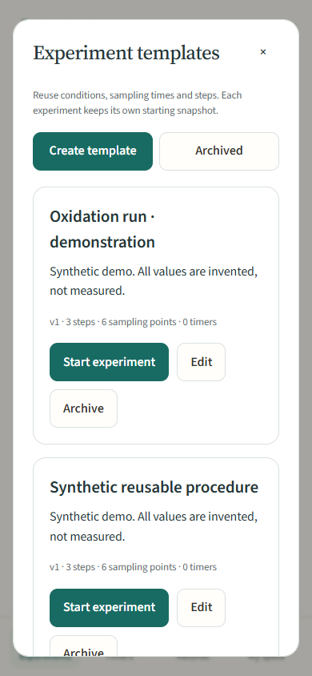
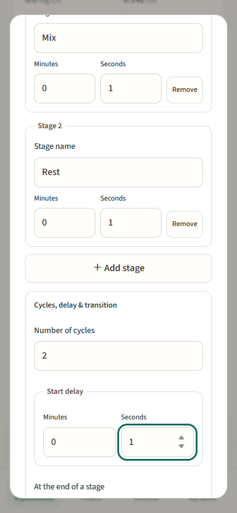
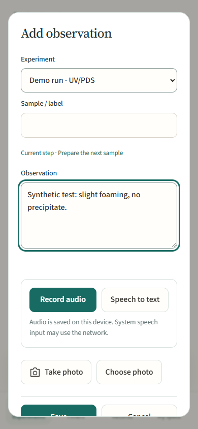

# EnvBench for Android · 0.8.0

**Keep your reaction schedule, samples and observations together — from the first dose to the final export.**

[简体中文](README.zh-CN.md) · [EnvEvidence desktop](../README.md) · [Screenshots and checks](../docs/ANDROID.md) · [Samples CSV](../docs/BENCH_CSV.md)

EnvBench is a local experiment notebook for advanced-oxidation and DOM work in water and wastewater. The four main tabs — **Experiments, Timers, Records and My space** — bring bench controls within reach. **Glacier** combines blue actions, soft blue-to-teal gradients and a floating frosted navigation bar. Crisp white panels keep measurements easy to read. EnvBench and the desktop app share locally bundled Source Sans 3 and Chinese sans-serif fonts, spacing and control styles.

The experiment home highlights the current run, its current step and the next sample. Open the run to follow its procedure, then use the floating action bar to add a photo, observation or count. Focus a timer for a larger display, browse dated observation cards, or choose a template by process, step count and planned duration.

 

## What you can do

- Follow named experiment steps, with independent countdowns and a history of completions, repeats and reasoned skips.
- Save reusable experiment templates containing conditions, water-matrix data, sampling plans, steps and timer presets.
- Run independent stopwatches, countdowns and multi-stage timers, with repeats, a start delay and automatic or manual transitions.
- Record and replay audio observations, draft editable text through Android speech input, and insert personal observation phrases.
- See the next checkpoint, record planned and actual timing, and add unplanned samples without changing the plan.
- Record quench agents, pH, temperature and volume, with measured, carried-over and unmeasured field labels.
- Keep water-matrix properties, notes and sample photos with the reaction.
- Paste LC peak areas, check sample assignments and review C/C₀ trends with a pseudo-first-order fit.
- Keep correction history, with reasons for timing corrections and fit exclusions.
- Export samples to CSV, an experiment to ZIP, or the whole notebook with original photos.

**Android 8.0+ · English and Chinese · Offline · No account required**

## Install and explore

The published installer is 0.7.0; this branch prepares the 0.8.0 Glacier release.

**[Download EnvBench 0.7.0 APK](https://github.com/gzpagg/envevidence/releases/download/v0.7.0-android-preview.1/envbench-0.7.0-android.apk)** · [SHA-256 checksum](https://github.com/gzpagg/envevidence/releases/download/v0.7.0-android-preview.1/envbench-0.7.0-android.apk.sha256) · [Release notes](https://github.com/gzpagg/envevidence/releases/tag/v0.7.0-android-preview.1)

Open the downloaded APK on your Android phone and allow installation from the browser or file app when Android asks. This signed preview uses the same application identity and maintainer signing key as the earlier app, so it can update an existing installation in place.

Keep Android System WebView up to date. Install the update over your existing app to retain local records. Export a full ZIP backup before uninstalling or moving devices; uninstalling removes private app data.

Open **My space → Load lab demo** to add an invented UV/PDS run with samples and water data. Demo loading preserves your existing notebook.

## Walk through a reaction run

1. **Start the reaction.** Tap **New reaction run**, select the process and target, and enter oxidant dose, wavelength, fluence rate and sampling times in minutes, for example `1, 2, 5, 10, 20, 30`. Saving starts the experiment clock at t = 0.
2. **Follow the plan.** The run page prominently shows the next checkpoint and its approaching, due or late state. Planned and recorded sample times are saved separately.
3. **Record a sample.** Tap **Take sample** to capture the operation time. Choose a quench agent or explicitly choose **None**, then add pH, temperature, volume and a note. Confirm measured values and identify values carried over from the previous sample. Samples are labelled S-001, S-002, ….
4. **Add context.** Record matrix, batch, filtration, spiking, DOC, UV₂₅₄, alkalinity, chloride, nitrate-N, bromide, conductivity and pH. SUVA₂₅₄ is calculated from DOC and UV₂₅₄; unmeasured properties stay empty. Attach photos and short observations as the reaction proceeds.
5. **Add analytical results.** Open **Paste LC peak areas**. Paste one sample label and area per line, such as `S-003  12345`, or one area per line in sample order. Select the reference and inspect the preview. Correct every import error before applying. C/C₀ can also be entered directly.
6. **Review the trend.** See k_obs, its 95% confidence interval, half-life and R², together with the fitted time range and exclusion count. A curvature flag identifies deviation from a single first-order model. Record a reason when excluding a sample. Fluence and dose normalization appear when their required inputs are present.
7. **Correct and export.** Edits retain previous values and sources. Timing corrections require a reason and preserve the original button-event intervals. Export **Samples CSV**, an experiment ZIP or a full backup.

 

The [CSV guide](../docs/BENCH_CSV.md) gives column definitions, units and calculation assumptions.

## Steps and reusable experiments

Open an experiment and choose **Add steps** to write the procedure in order. Each step has a name, instructions and an optional countdown. Start the current step, complete it, or choose **Skip with reason**. **Repeat step** creates a fresh attempt while preserving earlier actions. Finishing the experiment retains completed work and records unfinished steps as cancelled.

Choose **Save as template** from an experiment, or open **Experiments → Experiment templates** to create and edit a template. Templates include reaction and water conditions, sampling times, steps and independent timer presets. Starting from a template lets you adjust the new run's name and conditions, then saves that starting configuration as an independent version snapshot. The new run gets fresh sample identifiers and its own observations and results.

Step countdowns start when the step starts. The reaction's t = 0 and its sampling plan remain anchored to the experiment start.

 

## Timers, counters and observations

Use a regular experiment for work without a reaction preset. Add named stopwatches, countdowns or **Multi-stage timers**. A stage sequence can repeat and begin after a delay. Automatic mode advances through the sequence; manual mode waits for your confirmation before continuing, so confirmation time stays separate from active timer time. Start or pause a group, record laps and reset timers while retaining event history. Timer count has no fixed application cap; device memory and storage determine practical capacity.

Sampling checkpoints stay anchored to the experiment start. Pausing a reminder does not move its target. Finishing an experiment logs untaken checkpoints as skipped. Counters support +1, undo and separate rounds. Observations preserve creation time, experiment elapsed time, sample labels and previous text revisions. Photos retain original files and metadata; their record time describes when the image was added to the notebook.

In an observation, choose **Record audio**, then **Stop & save audio** to retain the clip. Recordings play directly beside the note and are included in experiment and full ZIP exports. Leaving the foreground saves the active clip. Each recording can last up to 30 minutes or 30 MB. **Speech to text** uses the installed Android speech service to draft text that you can edit; network use depends on that service. **Records → Manage observation phrases** lets you keep frequently used descriptions ready to insert. An observation made during a step retains that step association.

 

## Alerts, settings and backup

**My space** contains language, appearance, permissions, imports and exports. In appearance, choose Glacier or another saved palette and enable **Reduce transparency** for solid navigation and action bars. Fresh installations use Glacier; upgrades migrate an unchanged default Mineral palette while retaining other presets and custom colors. The interface respects reduced-motion settings and falls back to solid surfaces where background blur is unavailable.

Open **Enable timer alerts** and allow notifications and alarms for background countdown alerts. Android schedules the next countdown or stage boundary and groups simultaneous alerts; tapping a notification opens Timers. System notification settings and force-stop behavior apply.

Within one device boot, timing uses Android's monotonic clock. After reboot or transfer, recovery uses saved wall-clock times. Imported running timers are paused.

Camera and gallery use Android's system apps and picker. JPEG, PNG and WebP files up to 30 MB each are supported. Records and originals stay in private app storage; the experiment workflow makes no API calls.

Full ZIP backups include workspace data, original photos, recordings and display previews. Experiment ZIPs contain the selected experiment, its associated records and media, its workflow snapshot and referenced templates; full backups also retain all templates and observation phrases. Archives support up to 512 MB of uncompressed content; export larger notebooks by experiment. Import retains existing IDs and checks media hashes, missing attachments and photo or audio conflicts. Legacy evidence and planning data remain in full backups.

Literature extraction and source review are available in [EnvEvidence for desktop](../README.md).

## Build and validation

Use JDK 17+, Android SDK 36 and build-tools 35.0.0. The Gradle 8.13 wrapper is included.

```sh
cd android
./gradlew lintDebug testDebugUnitTest assembleDebug assembleRelease
cd ..
node --test android/tests/*.test.cjs
```

On Windows, use `gradlew.bat`. The [Android workflow](../.github/workflows/android.yml) runs JavaScript checks, Android lint, APK builds and Android 15 emulator instrumentation. Released APKs use a stable private maintainer key.

The interface is bundled HTML/CSS/JavaScript presented through WebViewAssetLoader. Java handles atomic private storage, clocks, alarms, notifications, camera/file access and ZIP/photo preservation. See [recorded validation](../docs/ANDROID.md) for checked flows and device coverage.

Code and original synthetic fixtures are MIT licensed. See [third-party notices](../THIRD_PARTY_NOTICES.md) for component licenses.


Full ZIP backups include language and appearance preferences. Import merges records while retaining the current device’s language and appearance, so importing an experiment does not change its selected settings.
