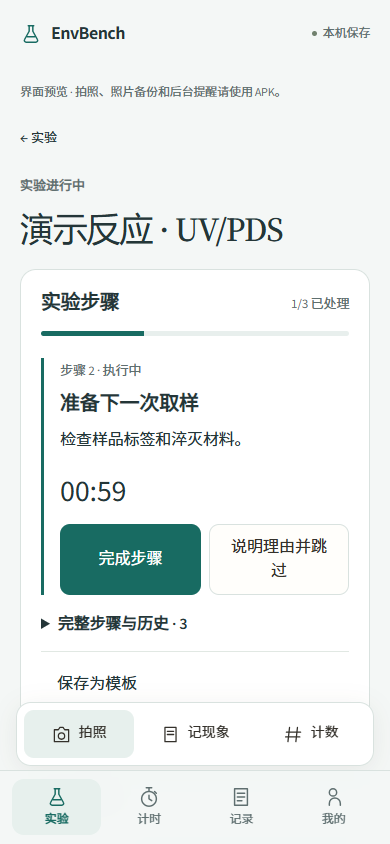
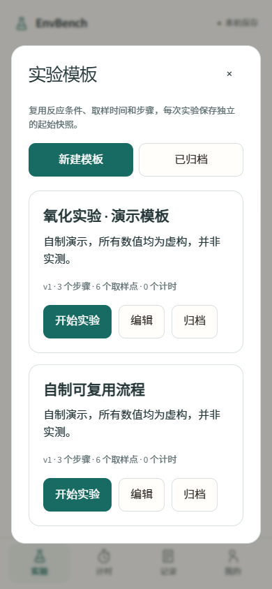
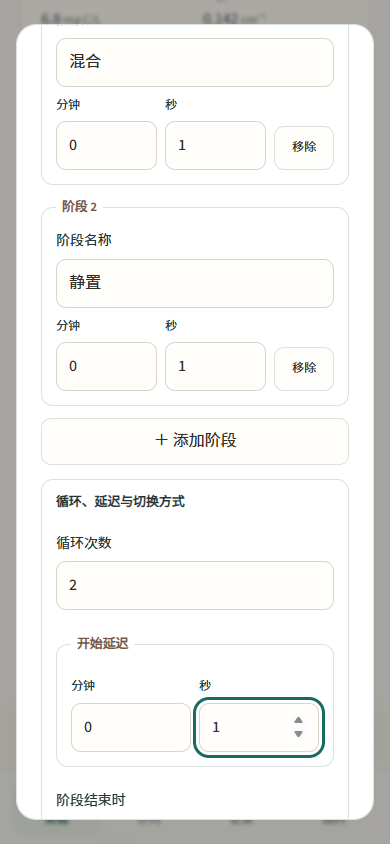
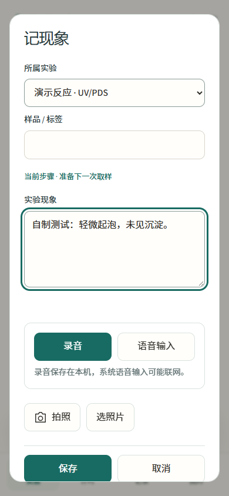

# EnvBench 安卓实验工具 · 0.7.0

**从开始反应到导出结果，把取样计划、样品与实验现象记录在一起。**

[English](README.md) · [EnvEvidence 电脑版](../README.zh-CN.md) · [截图与检查](../docs/ANDROID.md) · [样品 CSV](../docs/BENCH_CSV.md)

EnvBench 面向水与污水高级氧化、DOM 转化等实验。**实验、计时、记录、我的** 四个入口组织现场操作；“矿物青 · 浅灰”配色和宽裕的控件，让反应进行时的界面保持清楚。安卓与电脑版共用设计令牌，正文使用本地 Source Sans 3 与中文无衬线字体子集，主标题使用 Source Serif 4。

 

## 可以做什么

- 按命名步骤执行实验，配独立倒计时，保留完成、重新执行及说明理由后跳过的历史。
- 保存可复用的实验模板，包括反应条件、水体信息、取样计划、步骤与计时预设。
- 同时使用秒表、倒计时和分阶段计时，设置整组重复次数、开始延迟及自动／手动切换。
- 录制并回放实验口述，通过安卓系统语音输入形成可编辑文字，插入自己的常用现象短语。
- 查看下一取样点，分别记录计划时间与实际记录时间，添加计划外样品而不改变计划。
- 为每个样品填写淬灭剂、pH、温度与体积，用实测、沿用、未测标签说明来源。
- 将水体基质、现象说明和样品照片与反应关联保存。
- 粘贴 LC 峰面积，核对样品与数值对应，查看 C/C₀ 变化与准一级拟合。
- 保留修订历史，包括时间修订及拟合排除的理由。
- 导出样品 CSV、单次实验 ZIP，或包含原始照片的完整实验手记。

**Android 8.0+ · 中英文界面 · 离线运行 · 无需账号**

## 安装与体验

**[EnvBench 0.7.0 发布与 APK](https://github.com/gzpagg/envevidence/releases/tag/v0.7.0-android-preview.1)**

0.7.0 安装包正在等待 CI 发布，正式签名 APK 和 SHA-256 校验文件将提供在该页。

在安卓手机上打开下载的 APK，按系统提示允许浏览器或文件应用安装。签名预览版沿用原应用身份与维护者签名，可直接覆盖升级现有安装。

请保持 Android System WebView 更新，直接覆盖升级以保留本地记录。卸载或换机前先导出完整 ZIP；卸载会删除应用私有数据。

进入 **我的 → 载入实验演示**，可添加一组自制 UV/PDS 反应、样品和水质数据，保留已有实验手记。

## 完成一次反应实验

1. **开始反应。** 点 **新建反应**，选择工艺与目标物，填写氧化剂剂量、波长、辐照强度和以分钟表示的取样计划，例如 `1, 2, 5, 10, 20, 30`。保存即开始实验计时，记为 t = 0。
2. **跟随取样计划。** 反应页醒目展示下一取样点，临近、到点、迟到时显示不同状态。计划时间与实际记录时间分别保存。
3. **记录样品。** 点 **取样** 保存操作时间，选择淬灭剂或明确选择 **不淬灭**，再填写 pH、温度、体积和说明。确认实测值，标明沿用上一样品的值。样品依次编号为 S-001、S-002……。
4. **补充实验背景。** 保存水体类型、批次、过滤、加标、DOC、UV₂₅₄、碱度、氯离子、硝酸盐氮、溴离子、电导率与 pH。SUVA₂₅₄ 由 DOC 和 UV₂₅₄ 计算，未测项目保持空白。反应过程中可添加照片和简短现象记录。
5. **加入分析结果。** 打开 **粘贴 LC 峰面积**，每行填写样品编号和面积，例如 `S-003  12345`；也可按样品顺序每行填写一个面积。选择参比面积，检查预览并修正全部导入错误后再应用。C/C₀ 也可直接填写。
6. **查看变化趋势。** 界面展示 k_obs、95% 置信区间、半衰期和 R²，以及拟合时间范围和排除点数。曲率提示用于识别对单一一级模型的偏离；排除拟合点时填写理由。相关输入完整时显示辐照与剂量归一化结果。
7. **修订并导出。** 编辑样品会保留原值及来源。时间修订要求填写理由，并保留原始按钮事件的时间间隔。可导出 **样品 CSV**、单次实验 ZIP 或完整实验手记。

 

[CSV 说明](../docs/BENCH_CSV.md)列出字段、单位和计算假设。

## 实验步骤与复用模板

打开实验后点 **添加步骤**，依次写入步骤名称、操作说明和可选倒计时。开始当前步骤、完成操作，或 **说明理由并跳过**；选择 **重新执行** 会建立新一次执行，保留此前历史。结束实验时保留已完成工作，并记录未完成步骤的取消状态。

在实验中点 **保存为模板**，或进入 **实验 → 实验模板** 新建、编辑模板。模板包括反应条件、水体信息、取样时间、步骤和独立计时预设。从模板开始时，可以调整新实验的名称与条件，保存该次运行的独立版本快照；新实验使用全新的样品编号，逐次积累现象与结果。

步骤倒计时在开始步骤时启动；反应 t = 0 和取样计划继续以实验开始为基准。

 

## 计时、计次与现象

没有反应预设需求时，可使用普通实验。添加命名秒表、倒计时或 **分阶段计时**，设置阶段序列、整组重复次数和开始延迟。自动模式依次切换；手动模式在到点后等待确认，确认等待时间与有效计时分开保存。计时器支持整组开始与暂停、记录分段，归零后保留事件历史。计时器数量没有固定上限，实际容量取决于设备内存与存储。

取样点以实验开始为基准；暂停提醒不会顺延原计划。结束实验时，未取样的时间点记为已跳过。计数器支持 +1、撤销和新一轮计数。文字现象保留创建时间、实验时长、样品标签和修改历史。照片保留原始文件与元数据，照片记录时间表示图片加入实验手记的时间。

在现象记录中点 **录音**，再点 **停止并保存录音**，即可保留实验口述。录音在记录旁直接回放，并随单次实验 ZIP 和完整备份一起导出；离开应用前台时会保存当前录音。每条录音最长 30 分钟或 30 MB。**语音输入** 通过安卓系统服务生成可以继续编辑的文字，联网情况取决于该服务。进入 **记录 → 管理现象短语** 保存常用描述，记录时直接插入；在步骤执行期间建立的现象会关联该步骤。

 

## 提醒、设置与备份

**我的** 集中提供语言、配色、权限、导入和导出。通过 **启用计时提醒** 开启通知与闹钟权限。安卓安排最近一次倒计时或阶段到点提醒，同时到期的多个计时合并为通知，点击通知进入“计时”。系统通知设置和强行停止应用会影响提醒。

同一次设备启动期间使用安卓单调时钟；重启或换机后按保存的系统时间恢复。备份导入的运行中计时保持暂停。

相机和相册调用系统应用及选择器，支持单张不超过 30 MB 的 JPEG、PNG 和 WebP。记录与原图保存在应用私有目录，实验功能不调用 API。

完整 ZIP 包含工作台数据、原始照片、录音和预览图；单次实验 ZIP 包含该实验及关联记录、媒体，并保留共享模板与常用短语。每份压缩包支持最多 512 MB 解压内容，大型手记可按实验分批导出。导入保留原 ID，并核对媒体校验值、缺失附件和照片／录音内容冲突。早期文献与计划数据继续保存在完整备份中。

文献提取与原文核验使用 [EnvEvidence 电脑版](../README.zh-CN.md)。

## 构建与验证

需要 JDK 17+、Android SDK 36 和 build-tools 35.0.0，仓库提供 Gradle 8.13 wrapper。

```sh
cd android
./gradlew lintDebug testDebugUnitTest assembleDebug assembleRelease
cd ..
node --test android/tests/*.test.cjs
```

Windows 使用 `gradlew.bat`。[安卓自动检查](../.github/workflows/android.yml)运行 JavaScript 逻辑测试、Android lint、APK 构建和 Android 15 模拟器测试。发布 APK 使用稳定的维护者私有签名。

界面采用内置 HTML/CSS/JavaScript，通过 WebViewAssetLoader 显示。Java 负责私有目录原子保存、时钟、闹钟、通知、相机、文件访问和照片 ZIP。[验证记录](../docs/ANDROID.md)说明检查流程与设备覆盖情况。

代码与自制合成示例采用 MIT 许可，组件许可见[第三方说明](../THIRD_PARTY_NOTICES.md)。

