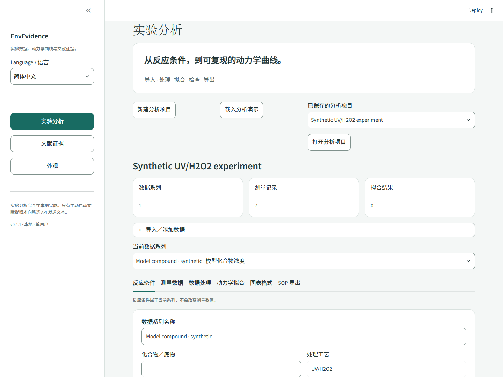
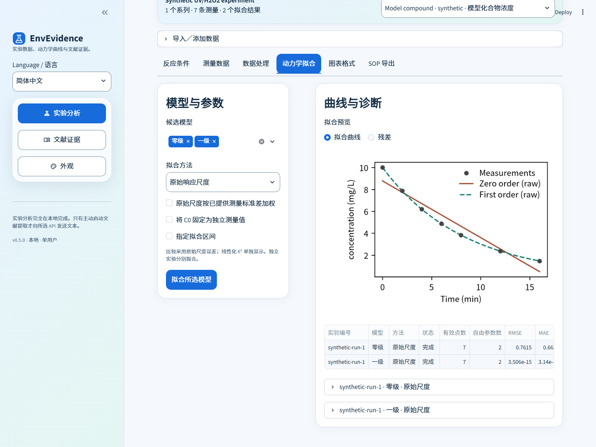
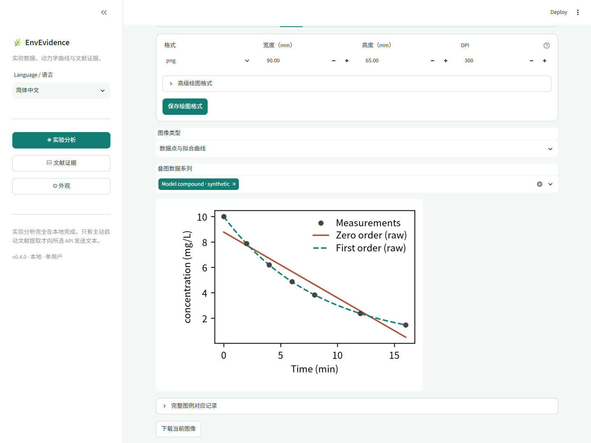

# 实验数据分析 · 电脑版 0.5.0

[English](ANALYSIS.md) · [安装方法](../README.zh-CN.md#安装电脑版) · [验证记录](VALIDATION.zh-CN.md)

EnvEvidence 将反应条件、已定量的测量结果、处理规则、模型拟合、图像与 SOP 成果包组织在同一个实验项目中。安卓端记录取样时间和现场过程，电脑端连接检测结果、比较动力学模型并输出可复现资料。

## 体验完整流程

1. 启动电脑版，打开 **实验分析 → 载入分析演示**。应用新建独立项目，使用 `C = 10 exp(−0.12t)` 生成的 UV/H₂O₂ 数据，反应条件明确标记为自制合成演示。
2. 检查 **反应条件** 和 **测量数据**。每条记录具有样品编号和独立实验编号。
3. 在 **数据处理** 中保留默认规则，或设置明确的校正，再通过预览检查计算各阶段。
4. 在 **动力学拟合** 中选择模型及原始尺度／适用线性化方法，点击 **拟合所选模型**，检查比较表、参数与诊断。
5. 在 **图表格式** 中查看曲线和残差，设置物理尺寸、DPI 与绘图样式并保存。
6. 在 **SOP 导出** 中选择用于成果图的拟合结果，确认核查后点击 **生成 SOP 成果包**，下载 ZIP 并与实验资料一同保存。



## 导入测量结果与现场记录

在 **导入／添加数据** 中选择降解／指标去除、吸附或生物反应速率，确定测量指标及自变量、响应的单位。Monod 的自变量是底物浓度，降解和吸附的自变量是反应／接触时间。

粘贴 CSV 或制表符分隔数据，也可上传 CSV／Excel 并选择工作表。映射时间／底物浓度和响应列，再按需要映射样品编号、独立实验编号、标准差、检出状态、排除标记和重复类型。Excel 应提供实际数值；上游使用公式计算时，导出仅含数值的工作表。

浓度数据示例：

```csv
x,y,sample_id,run_id
0,10,S0,R1
5,7.4,S1,R1
10,5.5,S2,R1
15,4.1,S3,R1
20,3.0,S4,R1
30,1.65,S5,R1
```

表头可使用自己的名称，通过字段映射指定含义。单位属于数据系列，单位不同时应拆分为独立系列。不同反应实验分别拟合；同一样品的检测重复标记为 `technical`，使用相同样品编号与时间，开启技术重复汇总后获得均值及样本标准差。汇总记录保留全部成员；该标准差表示重复的离散程度，不会自动作为均值的不确定性用于加权。

检出状态为 `valid`、`missing`、`below_lod` 和 `below_loq`，状态列也接受 `<LOD`、`<LOQ`、`ND`。删失数据可填 `<0.02` 并设置相应状态。这些记录连同排除理由保留在表中。修订与主动排除需要填写理由。

手机记录可导入 EnvBench 样品 CSV 或 ZIP；ZIP 保存实验快照、样品信息、事件、照片及修订历史。在 **测量数据 → 通过样品编号关联检测结果** 中上传检测表，映射编号和数值，填写结果单位与来源，即可关联实际取样时间。C/C₀ 保持相对值，提供明确参考浓度后才转换为绝对浓度。手机记录的取样体积与吸附计算中的反应液体积分别使用。

## 明确设置处理规则

预览显示原始值和每个计算阶段，处理顺序为：

1. 时间序列减去分析时间零点偏移，换算时间单位。
2. 按输入测量单位计算 `（测量值 − 空白）× 稀释倍数`。
3. 可为相对浓度应用绝对参考值，再进行兼容的单位换算。
4. 可除以明确的归一化参考值，或通过质量平衡计算吸附量。

空白默认零，稀释倍数默认一。摩尔与质量浓度属于不同换算组；TOC 的碳基准、COD 的氧基准分别保留。归一化参考值使用处理后响应单位，与拟合时是否固定 C₀ 分别设置。

浓度转吸附量采用：

`qt = (C0 − Ct) × V / m`

C₀、Cₜ 使用 mg/L，反应液体积 V 使用 L，吸附剂干质量 m 使用 g，得到 qₜ 的单位为 mg/g。启用时确认适用恒体积／独立瓶吸附质量平衡，且不存在其他去除过程。连续取样改变质量平衡、或同时发生降解时，输入另行校正的 qₜ。

## 模型与拟合选择

| 模型 | 原始尺度方程 | 适用线性化 |
|---|---|---|
| 零级衰减 | `C = C0 − k0t` | 原始尺度 |
| 一级衰减 | `C = C0 exp(−k1t)` | `ln(C) = ln(C0) − k1t` |
| 积分二级衰减 | `C = C0 / (1 + k2C0t)` | `1/C = 1/C0 + k2t` |
| 带平台一级 | `C = Cinf + (C0 − Cinf) exp(−k1t)` | 原始尺度 |
| 吸附拟一级 | `qt = qe[1 − exp(−k1t)]` | `ln(qe − qt) = ln(qe) − k1t`，需固定独立提供的 qₑ |
| 吸附拟二级 | `qt = k2qe²t / (1 + k2qet)` | `t/qt = 1/(k2qe²) + t/qe` |
| 颗粒内扩散 | `qt = kid√t + b` | 用户指定区间内按原始尺度拟合 |
| Monod 底物—速率 | `rate = rate_max S / (Ks + S)` | 原始尺度 |

吸附拟一级／拟二级默认 q₀ = 0，适用于新鲜吸附剂。扩散拟合使用明确选择的时间区间，所得直线描述该区间。TOC／COD 时间序列使用表观衰减模型；Monod 使用独立的底物—速率表，选择比生长速率、比底物利用速率或体积去除速率，并记录速率来源。

参数单位随输入确定：衰减 k₀ 为响应／时间，k₁ 为 1／时间，浓度积分二级 k₂ 为 1／（浓度·时间）；吸附拟二级 k₂ 为 1／（吸附量·时间），当 q 为 mg/g、时间为 min 时即 g／（mg·min）。Monod 的 Kₛ 与底物浓度同单位，`rate_max` 与所选速率同单位。C/C₀ 拟合所得系数属于相对尺度，解释有浓度量纲的二级系数需要绝对参考浓度。

**默认使用原始响应尺度的最小二乘。** C₀、qₑ 默认估计，也可固定为独立测得的值，使用处理后响应单位。平台模型满足 `0 ≤ Cinf ≤ C0`，动力学速率使用物理范围约束。可根据已提供的正测量标准差按 `1/σ²` 对原始尺度拟合加权；线性化在变换尺度使用等权残差。

每次至少需要四个纳入点，并满足 `n ≥ p + 2`，p 为自由参数数；自变量至少有两个不同值。无效对数、倒数或 t/qₜ 变换会停止相应拟合并提示原因；需主动排除时填写理由，或选择其他方法。拟一级线性化需要固定 qₑ，拟二级线性化需要正时间与正吸附量。



比较原始尺度 RMSE、MAE、R²、点数、拟合区间和残差。变换尺度 R² 独立列出；不同点集在预测表中保留各自的纳入标记。由你选择用于成果图的结果，模型比较提供数值依据。

参数区间使用局部协方差的 95% 近似：等权拟合按残差估计并使用 Student t，给定标准差的加权拟合使用条件正态近似；线性化按变换尺度估计协方差。强参数相关、秩不足、边界或常量响应时隐藏不可靠的区间。固定参数和预处理参考值的不确定性不自动传播。解释动力学模型时，将数值诊断与实验依据一起判断。

## 图像与 SOP 成果包

默认 **90 × 65 mm、300 DPI、PNG**。可设置宽高、DPI、坐标轴、字号、线条／点形、配色、图例和误差条，将设置保存到项目或 SOP 模板。PNG、TIFF 包含栅格分辨率，SVG 保留矢量与物理尺寸。软件随附 Noto Sans CJK SC 字体及许可，支持中文标签；SVG 使用字形轮廓。大图渲染前检查五千万像素上限。



保存命名的 SOP 模板，可将处理规则、字段映射、模型和绘图格式复用到匹配实验类型与指标的系列。应用模板保留测量数据，重新计算后核查拟合结果。

ZIP 内容包括：

| 内容 | 用途 |
|---|---|
| `originals/` | 原样保留的上传文件或初次手动输入快照 |
| `processed.csv` | 处理阶段、单位、技术重复、纳入标记与排除理由 |
| `parameters.csv`、`predictions.csv`、`comparison.csv`、`curves.csv` | 参数、不确定性口径、每点预测／残差、候选模型比较和绘图坐标 |
| `analysis.xlsx` | 同一组数据表的可编辑工作簿 |
| `plots/` | 按所选格式输出的确认曲线、残差和适用线性化图 |
| `analysis_config.json`、`project_snapshot.json`、`manual_snapshot.json` | 重跑配置、完整项目与审计历史 |
| `manifest.json`、`SOP.md` | 文件校验值、软件／字体来源和可填写解释的处理说明 |

候选模型数据表完整保留，确认的结果决定成果图。每次导出使用独立文件名，保留早期成果包。

解压 ZIP 后，在已经安装软件的仓库目录中运行：

```bash
envevidence analyze --config "path/to/extracted/analysis_config.json" --output data/replayed
```

Windows 未激活虚拟环境时，用 `.\.venv\Scripts\python.exe -m envevidence analyze` 加相同参数；macOS／Linux 用 `.venv/bin/python -m envevidence analyze`。重跑验证原文件 SHA-256，从快照重新处理和拟合，并保存独立项目与成果包。已记录的软件版本便于复现计算环境；跨版本比较使用数值容差。

实验项目在 `data/analysis/`（或指定的数据根目录）中原子保存。备份包含原文件的完整目录；既有文献项目保留原格式与核验历史。科学计算与界面检查见[验证记录](VALIDATION.zh-CN.md)。
