# EnvBench screenshots and validation

[English guide](../android/README.md) · [中文说明](../android/README.zh-CN.md) · [Samples CSV](BENCH_CSV.md)

## Current interface · 0.6.1

All 16 Android screenshots show the actual bundled 0.6.1 interface running in a local Chromium browser preview. The viewport and exported PNGs are 390 × 844 pixels. An isolated synthetic UV/PDS experiment supplies the sample names, water properties and analytical values. English and Chinese views use the same product layout. The six desktop screenshots show the running EnvEvidence 0.3.0 Streamlit app at 1440 × 1080.

| View / 页面 | English | 简体中文 |
|---|---|---|
| Run / 反应 | 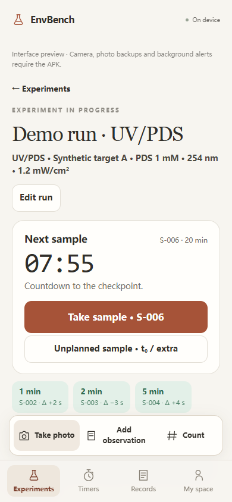 | 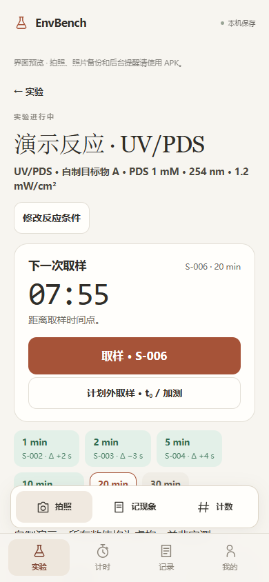 |
| Sample sheet / 取样 | 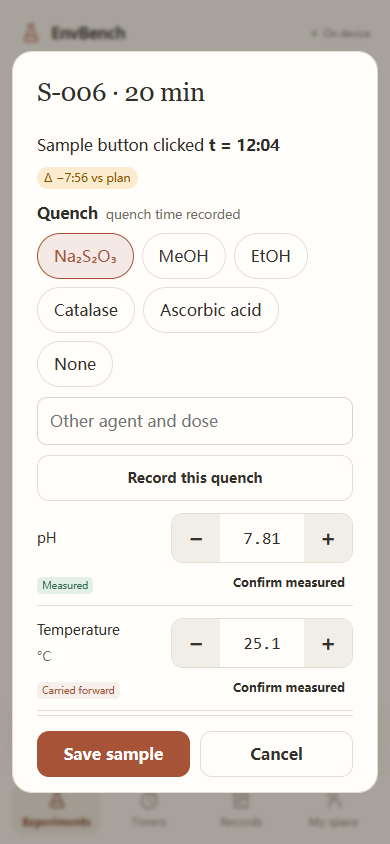 | 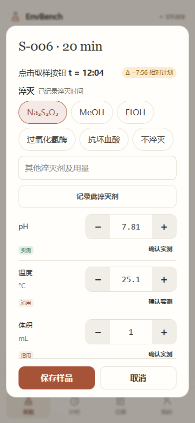 |
| LC import / 峰面积导入 | 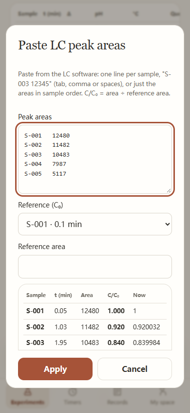 | 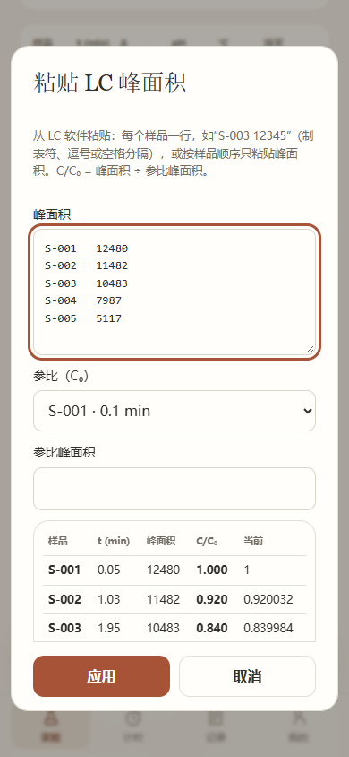 |
| Samples and fit / 样品与拟合 | 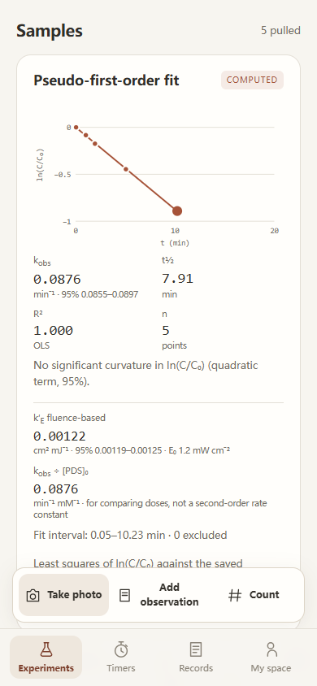 | 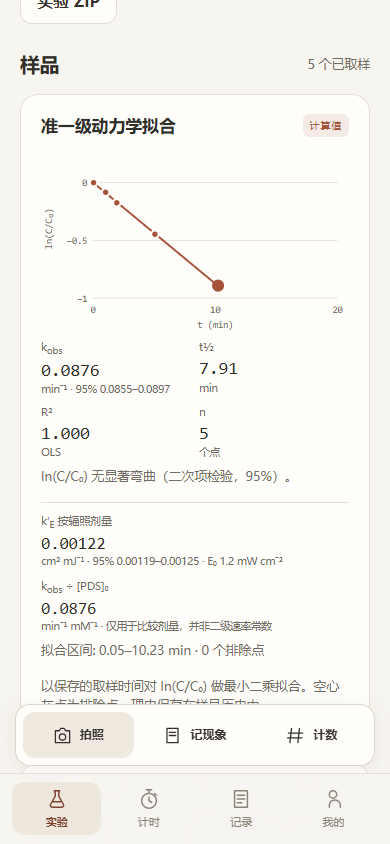 |

These are browser interface captures. Native camera, storage, notification and activity behavior have separate Android instrumentation coverage described below.

## Release checks

**Local checks passed:** 56/56 Android JavaScript tests, 46 desktop Python tests and Ruff. Version 0.6.1 adds regression coverage for peak-area assignment, rejected batches, measurement sources, timing revisions, exclusions and CSV audit columns. The new 0.6.1 Android lint/build/emulator CI run has not run yet; the previous verified baseline is linked separately below.

The release checklist covers:

- Invalid and internal empty area rows retain their positions; every error blocks applying the batch. Duplicate, extra and mixed-format assignments are rejected before data changes.
- Measured, carried-over, unmeasured and legacy-unknown sample sources survive save, import and export.
- Timing corrections preserve original events, require a reason and update the time used by the fit.
- Unplanned sampling leaves the scheduled checkpoint intact.
- Fit exclusions retain their reasons. Zero ratios remain recorded and are identified as ineligible for logarithmic fitting.
- Curvature checks use centered/scaled time and describe model deviation. The interface displays the fitted interval and exclusion count.
- English/Chinese sample sheets, imports, corrections and exports render with the default warm-paper/terracotta appearance.

## Recorded baseline · 0.6.0 / desktop 0.3.0

The merged implementation passed [Android CI](https://github.com/gzpagg/envevidence/actions/runs/36945435012) and [desktop CI](https://github.com/gzpagg/envevidence/actions/runs/36945434951). Android CI ran lint, JavaScript checks, APK compilation and Android 15 emulator instrumentation. The desktop matrix ran on Windows/Linux with Python 3.11/3.13.

The 41 Android JavaScript tests covered timers, counters, records, legacy migration and reaction-run features: checkpoints, sample/quench records, correction history, water validation, SUVA₂₅₄, curve fitting, exclusions, area conversion and CSV exports. Version 0.6.1 extends this baseline with the cases above.

Android instrumentation checked legacy data migration, count/undo, language and activity recreation, native image display, original-photo ZIP round-trip, experiment export isolation, background countdown notifications, notification routing and retained PDF parsing. The previous suite did not cover every new reaction-run interaction. Version 0.6.1 adds sample and import instrumentation cases; their native results will be recorded after the new Android CI run.

## Device and research coverage

The emulator uses generated images through the native photo-storage path. Physical-phone camera/gallery providers, long-duration runs, reboot recovery and manufacturer battery policies need separate device checks. System notification and alarm permissions govern background alerts.

Bench calculations are tested with synthetic numerical examples. Real LC datasets and independent use during laboratory experiments have not been evaluated as a validation dataset. Literature extraction has its own [validation record](VALIDATION.md).

## Backups and upgrades

Maintainer-signed updates retain the application ID and existing data. Export a full ZIP with original photos before uninstalling or moving devices. Import adds new IDs and pauses imported running timers; conflicting photo bytes are rejected. Archives support up to 512 MB uncompressed content, so larger notebooks can be split by experiment.

Version 0.6.1 keeps the lab schema at version 2 and adds CSV audit columns. Earlier nonempty measurement values have an unknown source until confirmed; empty values stay unmeasured. Existing evidence and planning data remain in full backups.

## Experiment notebook views · 0.6.1

The remaining eight captures show the current experiment notebook, timers, observations and My space pages in the same Chromium preview. They use isolated synthetic records and the same 390 × 844 viewport and PNG dimensions.

| View / 页面 | English | 简体中文 |
|---|---|---|
| Experiments / 实验 | 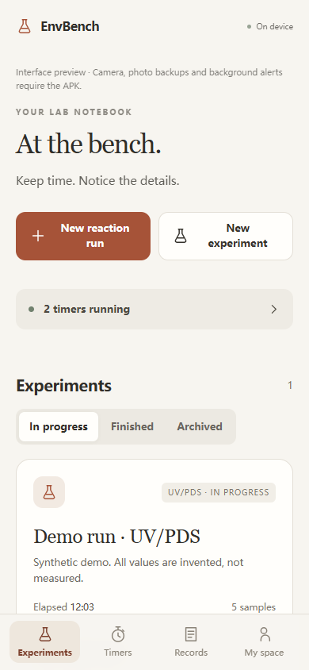 | 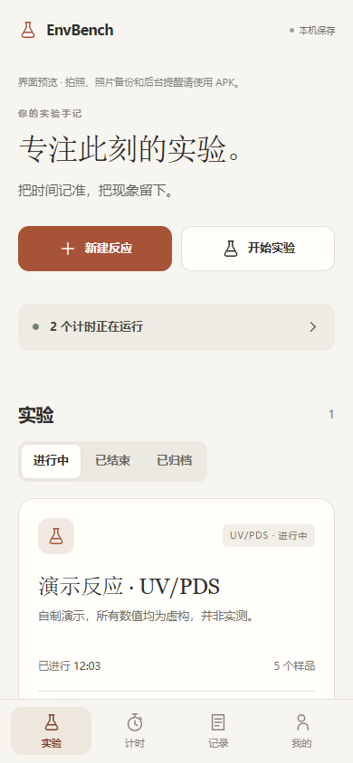 |
| Timers / 计时 | 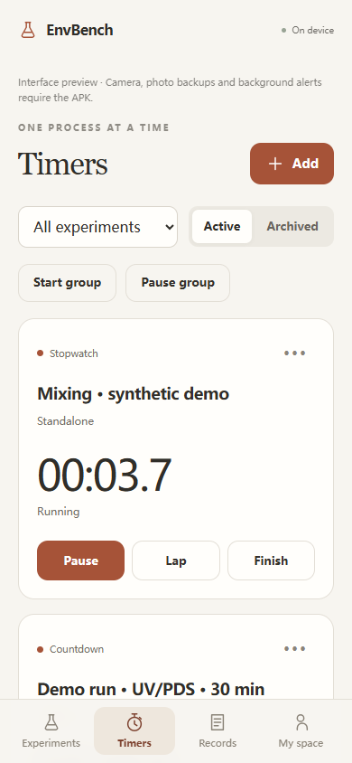 | 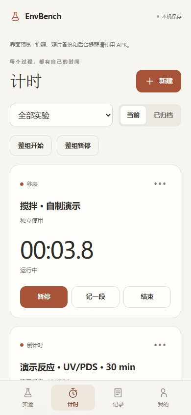 |
| Records / 记录 | 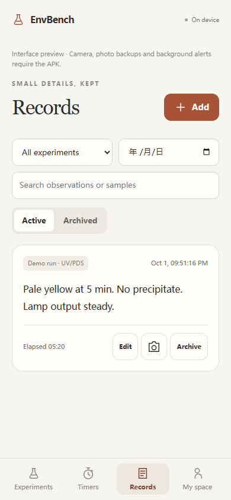 | 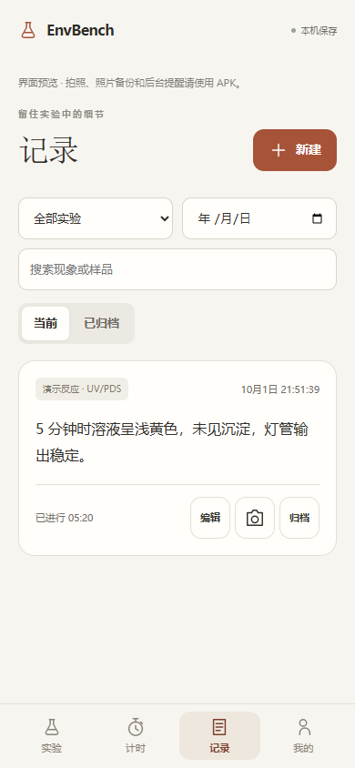 |
| My space / 我的 | 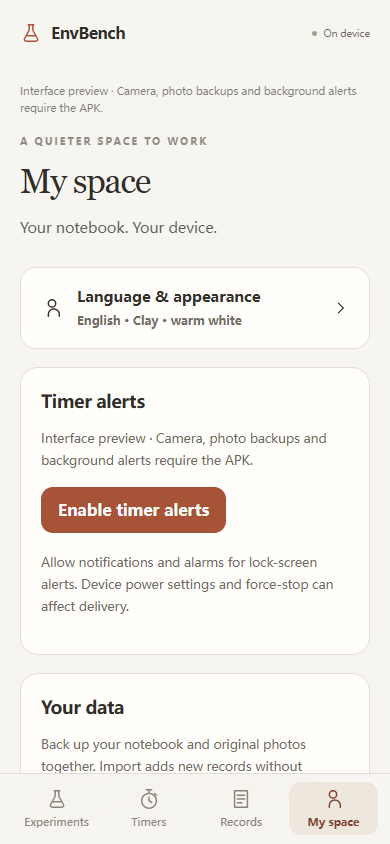 | 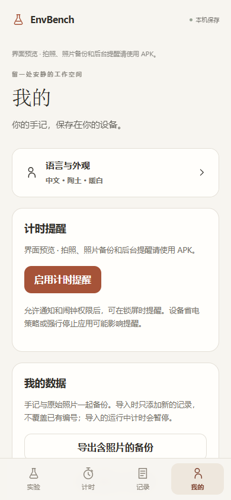 |

[Android workflow](https://github.com/gzpagg/envevidence/actions/workflows/android.yml) · [Desktop workflow](https://github.com/gzpagg/envevidence/actions/workflows/ci.yml)
