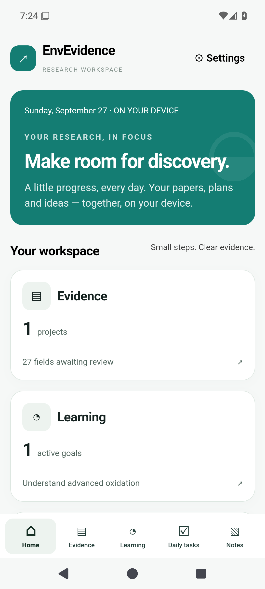
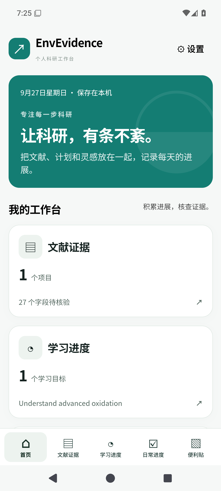
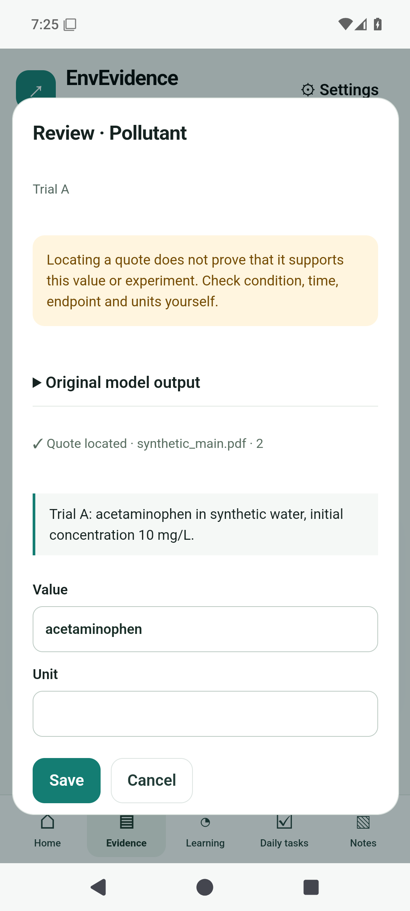
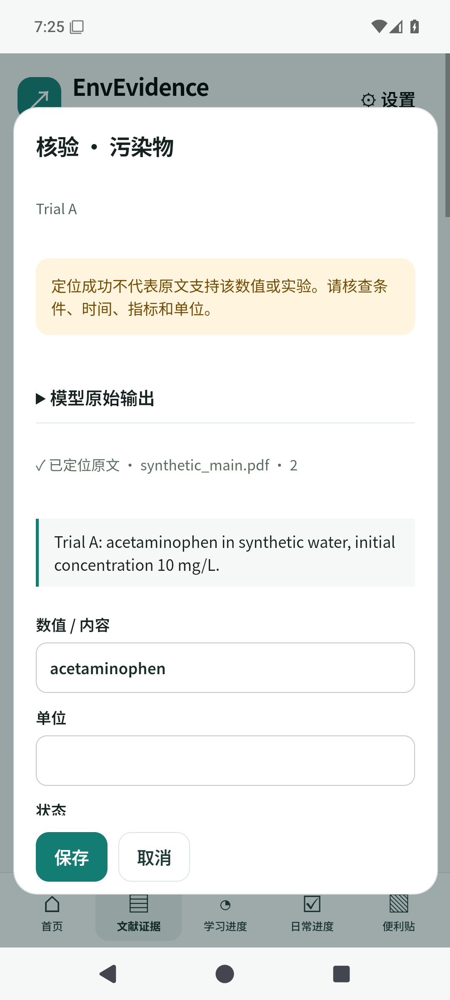
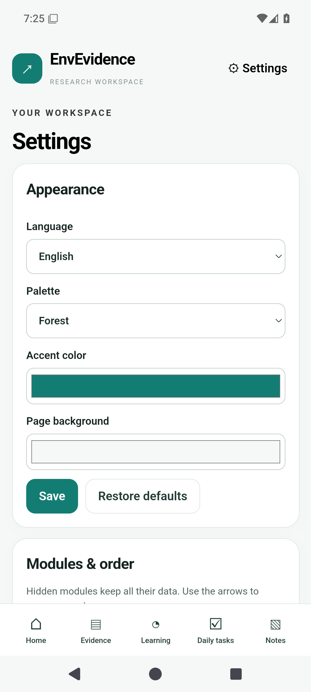
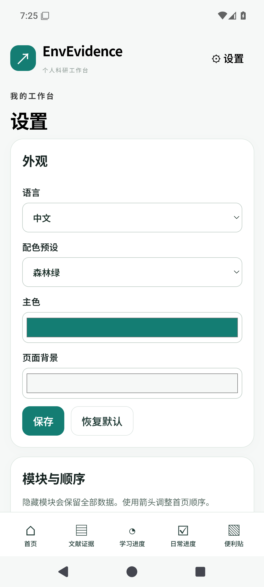

# Android preview: screenshots and validation

[Download APK](https://github.com/gzpagg/envevidence/releases/tag/v0.3.0-android-preview.1) · [English guide](../android/README.md) · [中文安装说明](../android/README.zh-CN.md)

These are unedited screenshots captured from the running APK on an Android 15 emulator. Every record comes from the app's invented, redistributable demo. There are no private papers, personal tasks or API keys in these images. Changing the interface language keeps user-entered content in its original language.

以下为 Android 15 模拟器内实际运行界面的原始截图，使用自制演示数据。切换界面语言不会翻译用户内容，因此中文界面中的英文演示任务会保持原文。

| View / 页面 | English | 简体中文 |
|---|---|---|
| Workspace / 工作台 |  |  |
| Evidence review / 证据核验 |  |  |
| Appearance and modules / 外观与模块 |  |  |

## What has been checked

- 12 JavaScript domain tests cover progress, dates, archive behavior, backup/import, extraction validation and quotation/revision rules.
- 50 existing Python regression tests pass. The desktop CI matrix passes on Windows and Linux with Python 3.11 and 3.13.
- Android lint, debug/release compilation and Android 15 emulator instrumentation pass. The device test exercises learning steps, task status, note archive/restore, language persistence, activity recreation, evidence review and native parsing of the synthetic PDF.
- The interface was checked at narrow and desktop widths, in both languages and with all four palettes. Native screenshots above document the default Forest theme.
- The release APK uses a private maintainer key and passes APK signature verification (v2 and v3). Signing material is excluded from Git and the APK.

See [Android build and emulator runs](https://github.com/gzpagg/envevidence/actions/workflows/android.yml) and [desktop CI](https://github.com/gzpagg/envevidence/actions/workflows/ci.yml) for recorded results. The APK's SHA-256 is published with the release.

## Remaining validation / 尚未验证

Real OpenAI/Anthropic calls, extraction accuracy on real research papers and physical-device compatibility have **not** been tested. Quotation matching establishes a source location, not scientific correctness. Review experiment identity, units, time points and result definitions yourself. This is a preview release, not a Google Play listing.

已通过离线逻辑、电脑版回归、安卓编译及 Android 15 模拟器测试。真实 API 调用、真实论文准确性和实体手机兼容性尚未验证。原文匹配只能确认位置，不能替代对实验归属、单位、时间及评价指标的科研判断。

Android exports CSV and JSON; Excel export is available in the desktop app. Export a full backup before uninstalling: app storage is local and cloud backup is disabled. Learning, daily planning and notes do not call a model. Only an explicit literature extraction sends document text to the selected API.

安卓支持 CSV/JSON 导出；Excel 导出保留在电脑版。卸载前请导出完整备份。本地学习、任务和便签不调用模型，只有主动开始文献提取时才发送论文文本。
